# BBSCute  
  
初始掃描可以看到有開一些奇怪的東西  
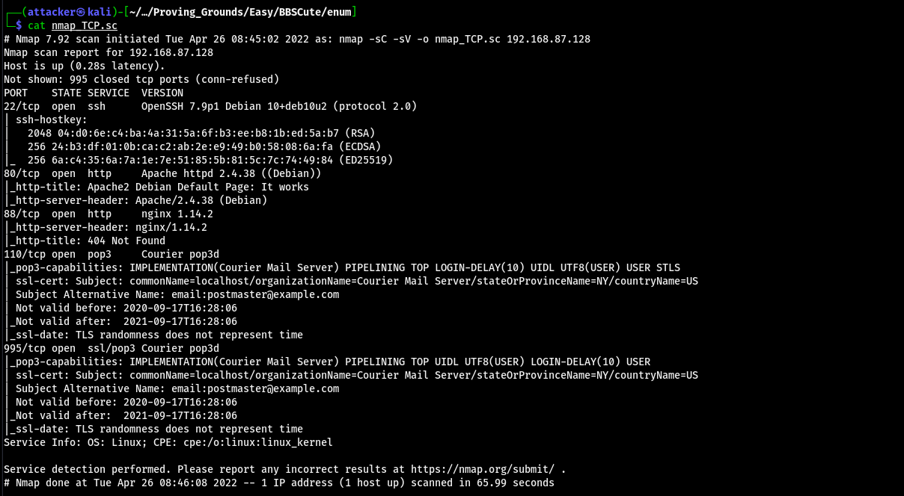  
  
對80掃下去會看到很多東西 連上index.php可以看到一個登入介面 CMS是CuteNews 2.1.2  
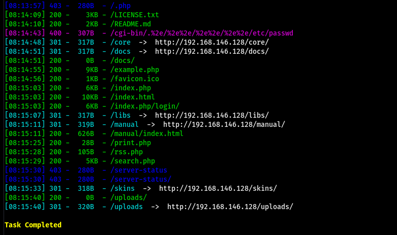  
  
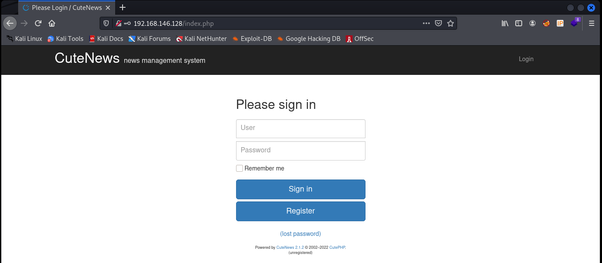  
  
查了一下發現有RCE的exploit  
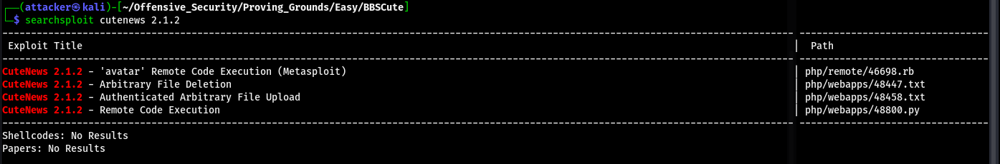  
  
直接拿來run 但會爛掉 看了一下exploit以後發現問題出在URL上 exploit上自己的URL前面有先加/CuteNews/ 但這台沒有 所以把這條去掉就能直接RCE了  
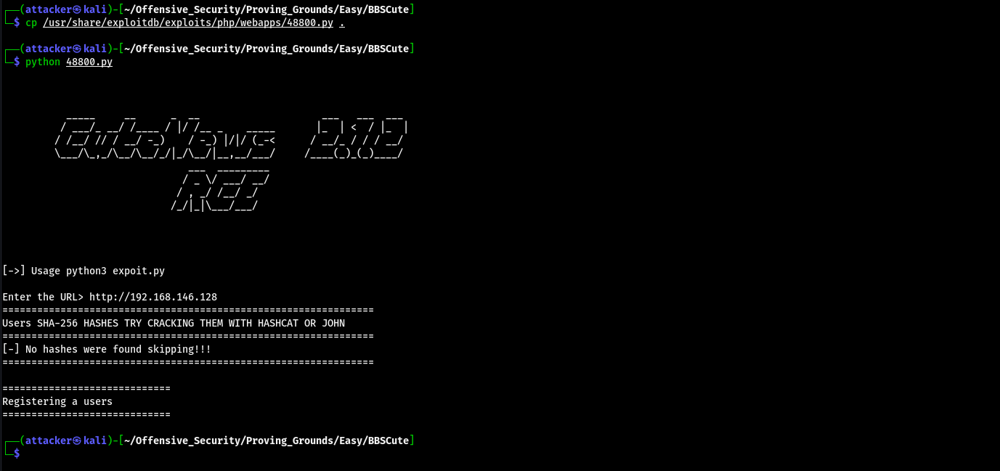  
  
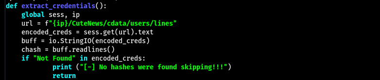  
  
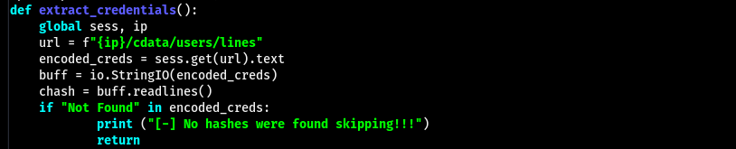  
  
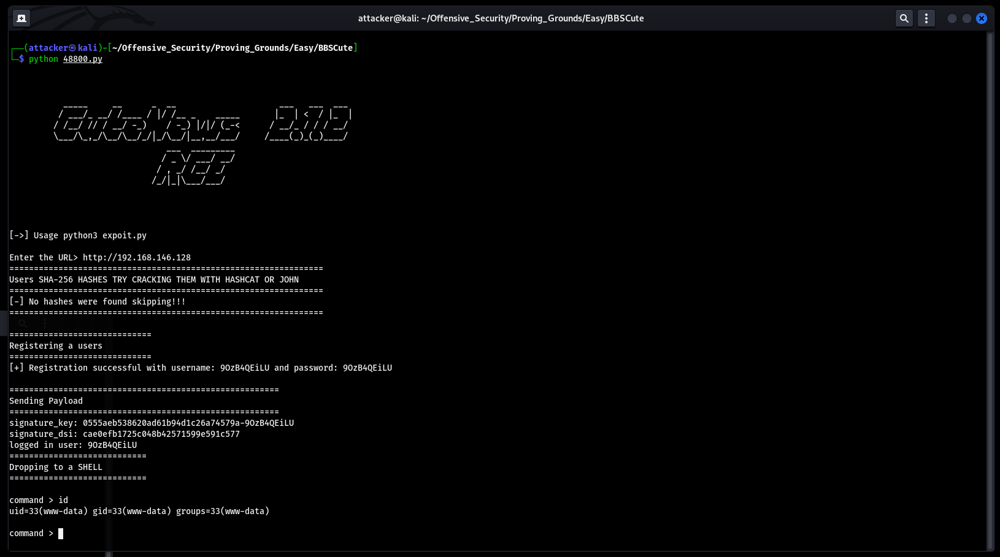  
  
隨便打一個reverse shell回來  
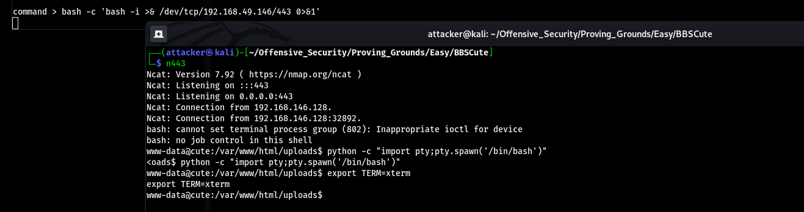  
  
#### 提權  
  
可以在SUID的地方找到hping3  
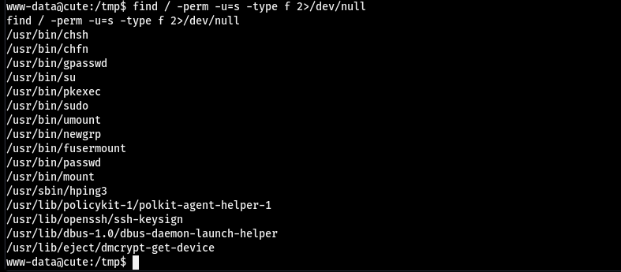  
  
直接用hping3生成一個帶root的shell  
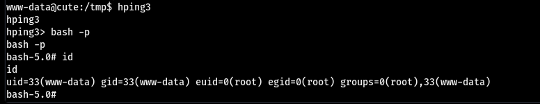  
  
#### Proof  
  
local.txt  
`73924563992114d5316d49ab2f08d541`  
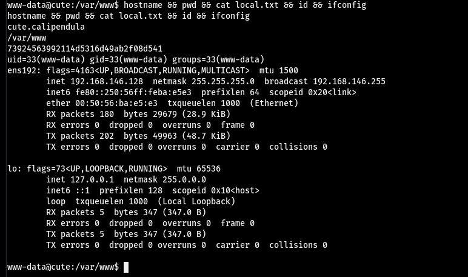  
  
proof.txt  
`dc254656522ddd0d7404d3ffc5d3c520`  
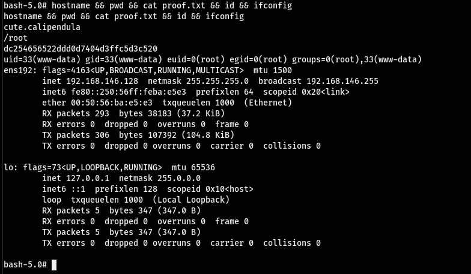  
