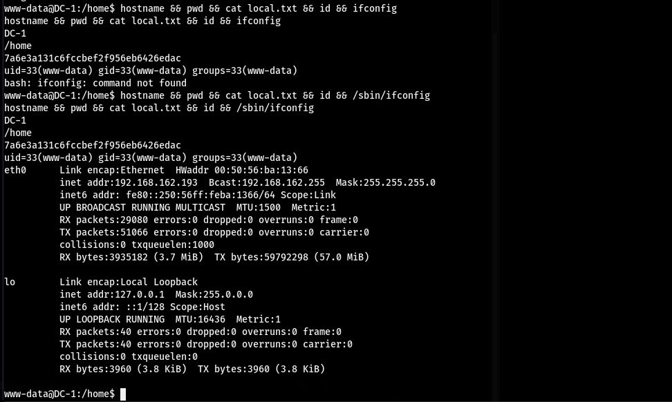

### DC-1  
  
看起來只能打Web?  
  
  
隨便掃一下 看到東西超多 80可能只是兔子洞 回頭看一下全Port的掃瞄發現有在50244開一個unknow  
  
  
  
  
針對這個50244下去掃一下可以看到是RPC(? 看來這個也沒用了QQ  
  
  
直接找Drupal 7的exploit 點進去第一個然後clone下來  
  
  
運行裡面的`drupa7-CVE-2018-7600.py`以後發現可以直接進行Code Execution 塞reverse shell的payload下去就RCE了  
  
  
#### 提權  
  
跑linPEAS發現find有SUID 到GTFOBins查了一下有相關的提權 直接照做就是root了  
`find . -exec /bin/sh \; -quit`  
  
  
  
  
  
  
#### Proof  
  
local.txt  
`7a6e3a131c6fccbef2f956eb6426edac`  
  
  
proof.txt  
`8a9b0b3297b1e7226c638863be572dd0`  
