# DC-2  
  
感覺這Port開的有點奇怪  
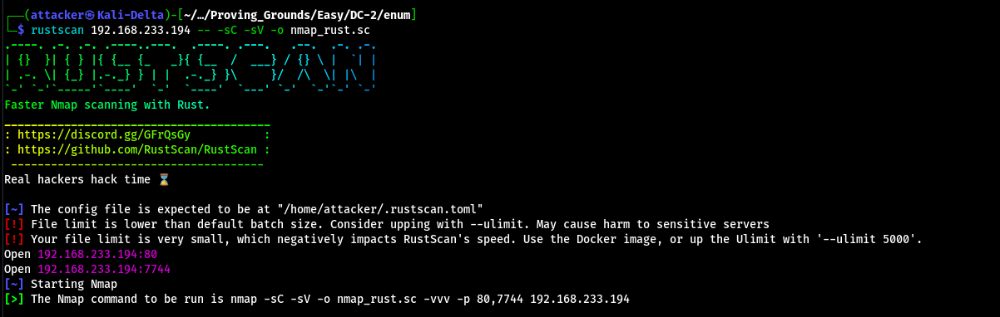  
  
原來7744是SSH  
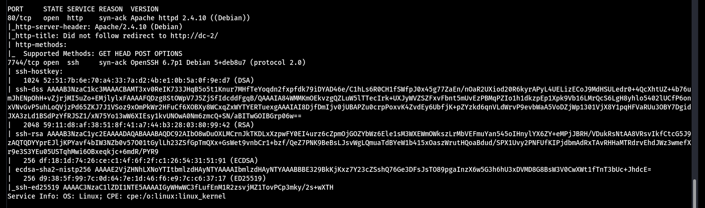  
  
連上80的時候網址會自動轉譯成dc-2 改一下hosts  
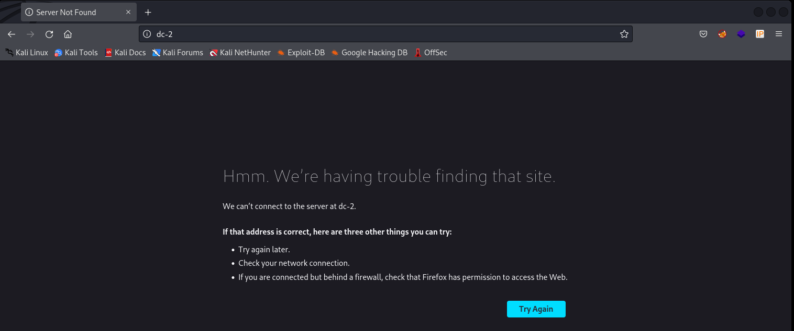  
  
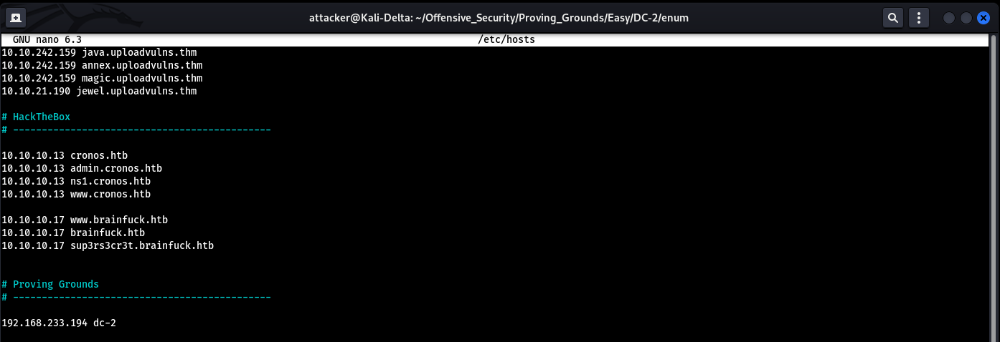  
  
掃路徑會發現是wordpress  
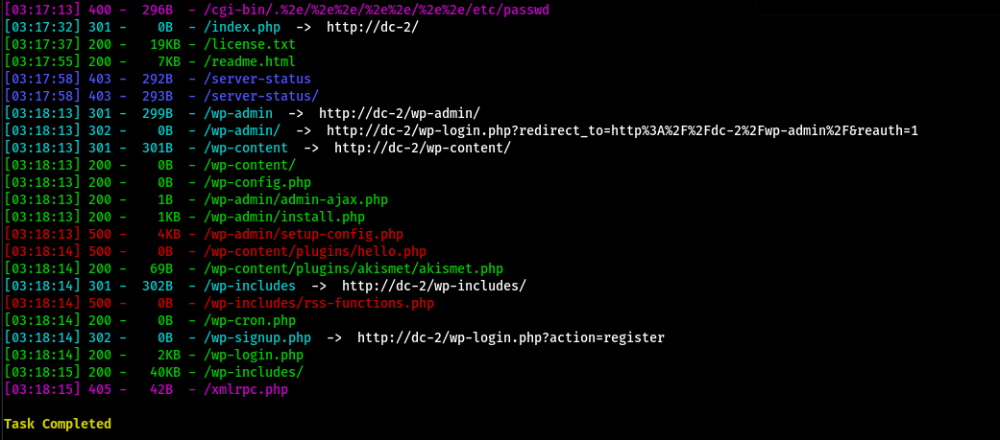  
  
上wpscan可以找到3個user  
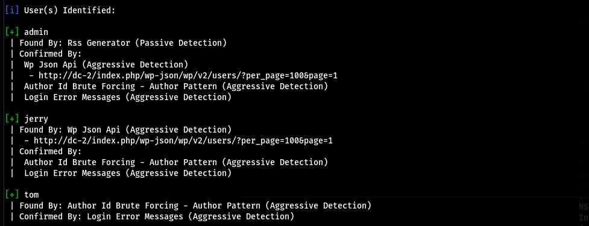  
  
在Flag可以看到他有提示我們使用cewl來產一個wordlist出來 順便也把user放進去另一個wordlist  
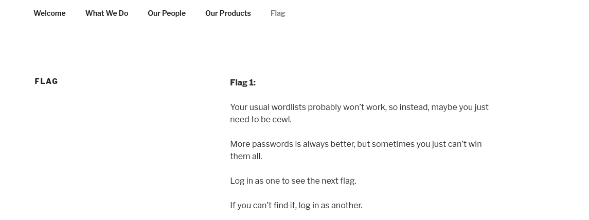  
  
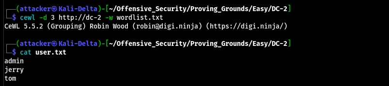  
  
拿這兩個wordlist去炸就能拿到憑證了  
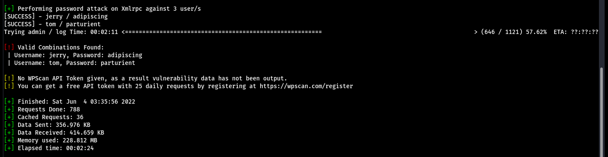  
  
但這兩個帳號說實話都沒什麼用 所以嘗試直接SSH上去 發現tom可以`tom:parturient`  
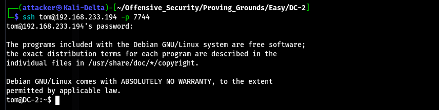  
  
#### 逃脫shell  
  
順利連上 但shell是受限的 不過發現可以用vi 照著下面打就能生一個正常的shell出來了  
```  
:set shell=/bin/bash  
:shell  
```  
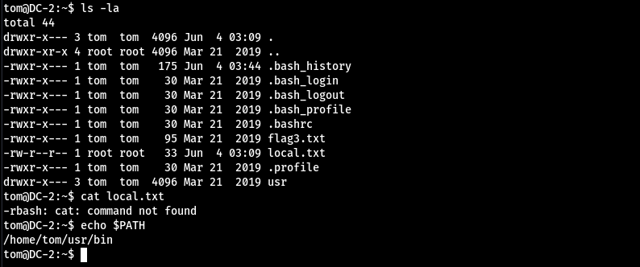  
  
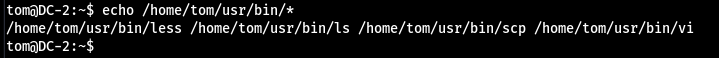  
  
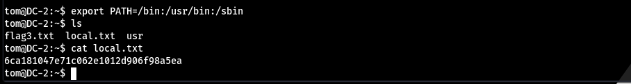  
  
#### 橫向提權  
  
直接`su jerry` 然後把剛剛的密碼拿過來用 發現可以`jerry:adipiscing`  
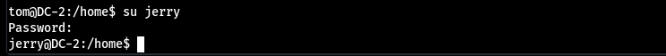  
  
#### 垂直提權  
  
`sudo -l`發現可以用git 跑去GTFOBins可以翻到一個生shell的指令  
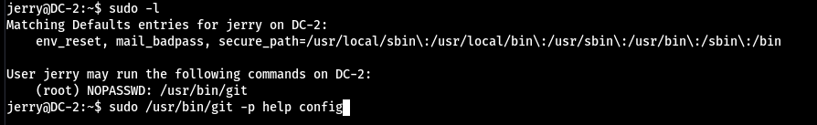  
  
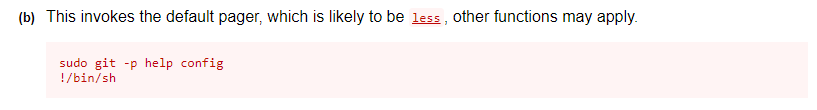  
  
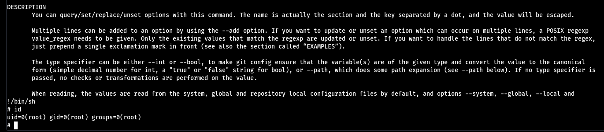  
  
#### Proof  
  
local.txt  
`6ca181047e71c062e1012d906f98a5ea`  
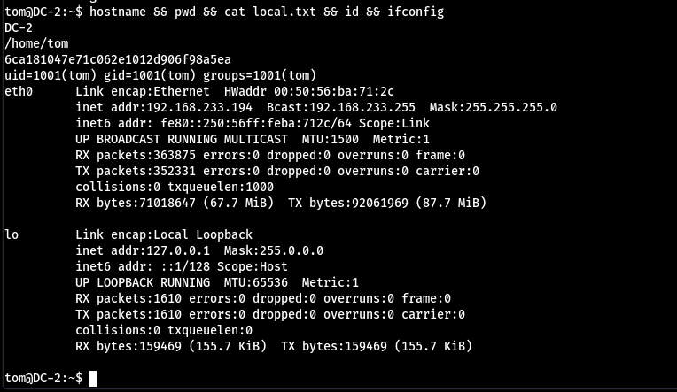  
  
proof.txt  
`3d9b1c37362a7abd504e6d72a5d65ccc`  
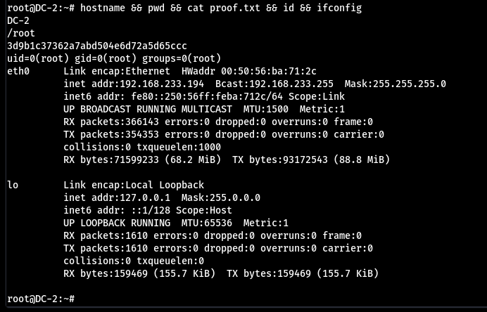