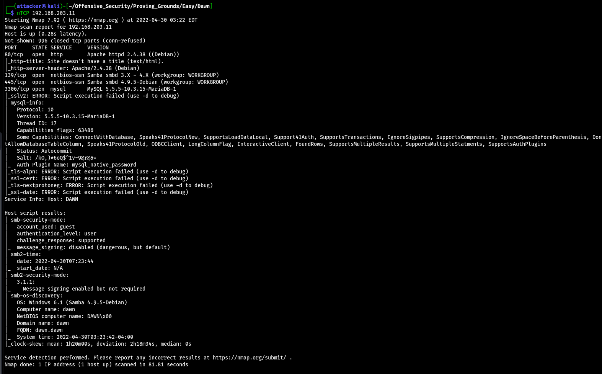
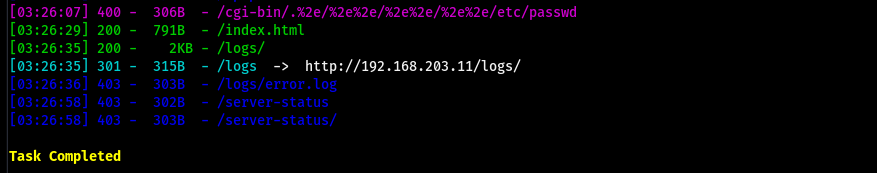
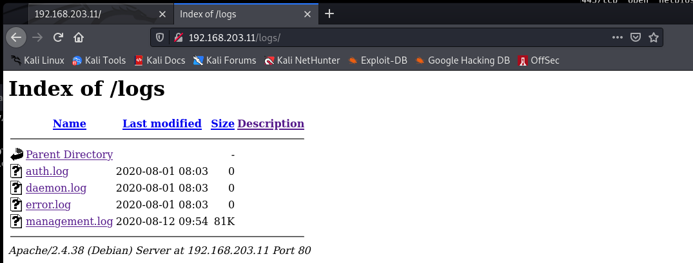
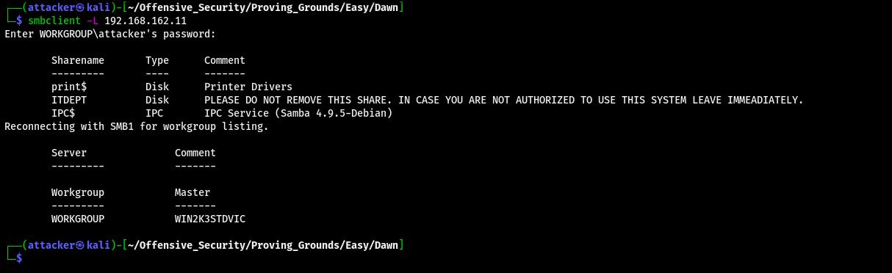
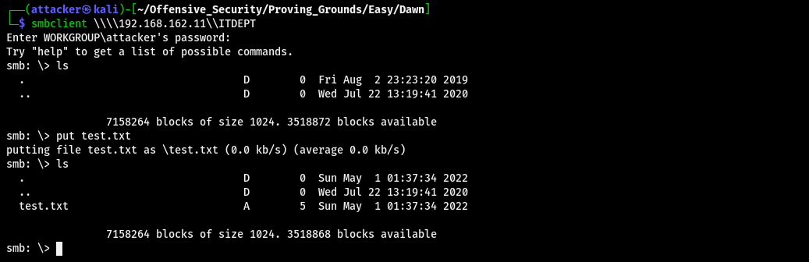
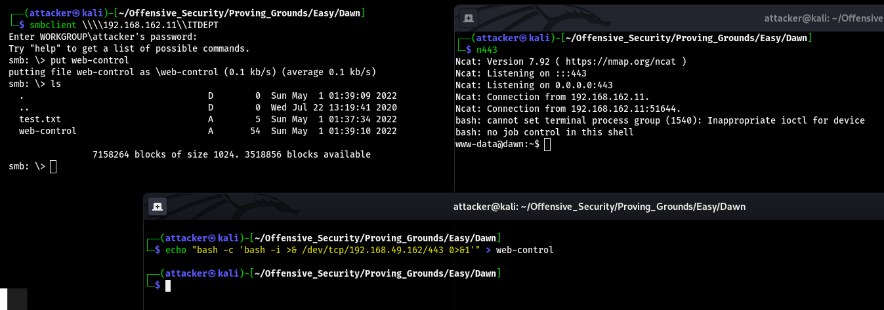
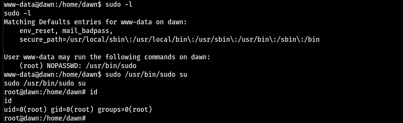
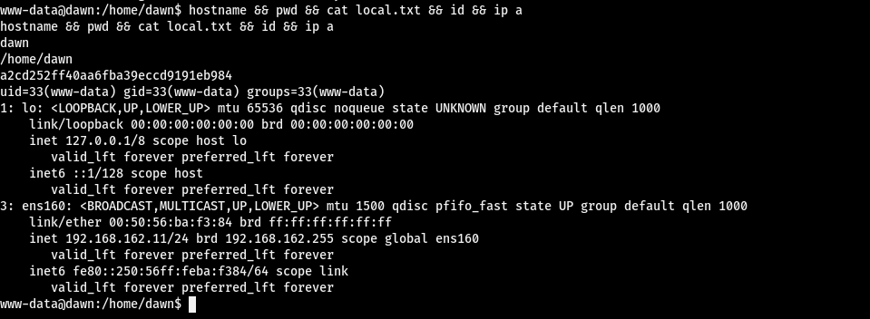
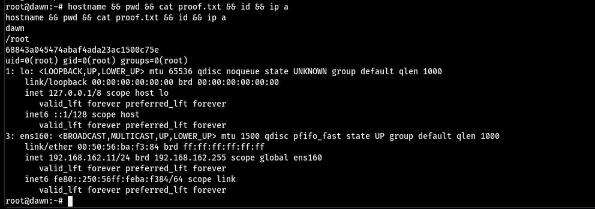

### Dawn

看起來是有兔子洞的機器

掃路徑有logs 進去以後可以看到一堆log 能把management.log載下來

看了一下發現他好像會一直執行ITDEPT下的web-contorl檔案

連SMB看到有一個同名的目錄 連上後還有寫入的權限

直接把reverse shell塞到web-control裡面再丟上去就RCE了

#### 提權

`sudo -l`發現可以NOPASSWD用`/usr/bin/sudo` 那就直接`sudo /usr/bin/sudo su`就是root了

#### Proof

local.txt
`a2cd252ff40aa6fba39eccd9191eb984`

proof.txt
`68843a045474abaf4ada23ac1500c75e`
