### FunboxEasy  
  
又是Web  
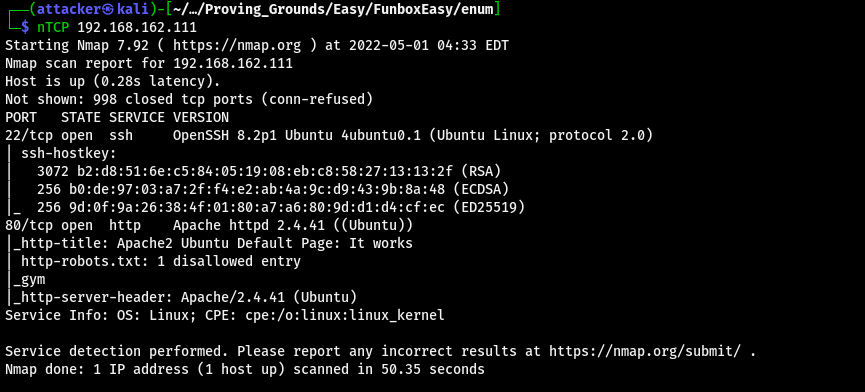  
  
掃了一下路徑 發現有幾條奇怪的東西 對secret掃下去以後可以看到更多奇怪的東西  
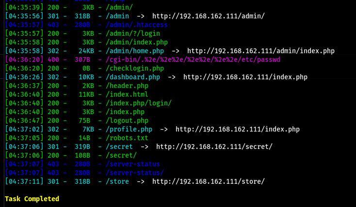  
  
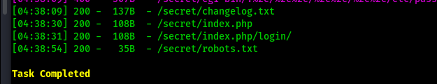  
  
看了一下 都沒有什麼用 到store裡面可以用`admin:admin`登入管理介面  
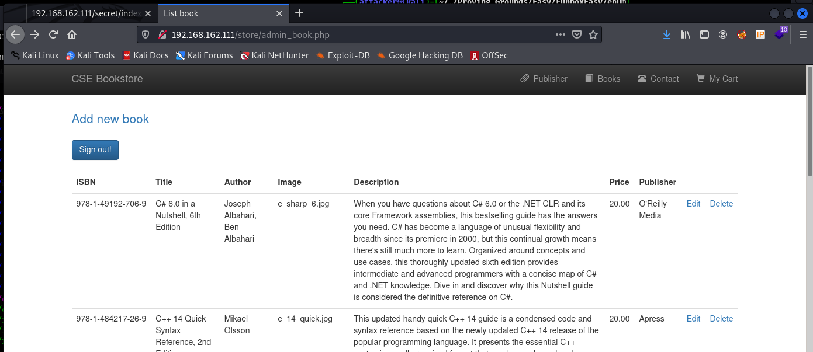  
  
但不知道怎麼RCE 查了一下有沒有exploit 發現一個  
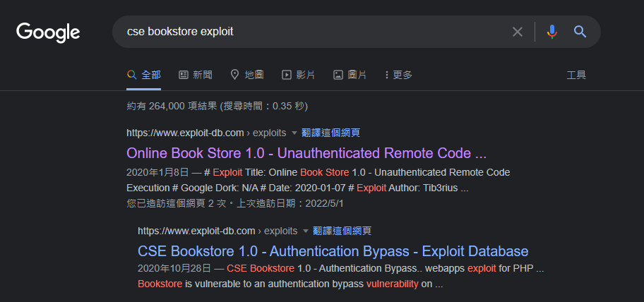  
  
運行以後發現能用 加一個reverse shell下去就直接RCE了  
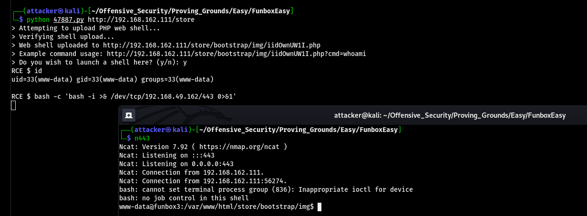  
  
#### 橫向提權  
  
在`/home/tony`下可以發現一個叫`password.txt`的檔案 打開後發現是一坨憑證 可以用這個憑證`su tony`  
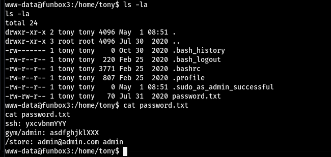  
  
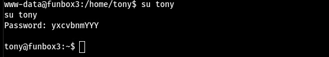  
  
#### 垂直提權  
  
`sudo -l`看到一堆東西 這根本隨便提 直接`sudo /usr/bin/pkexec /bin/sh`就是root了  
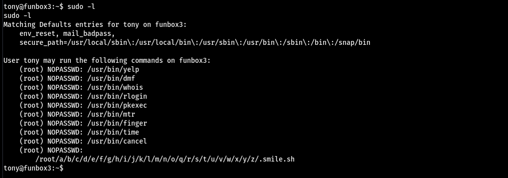  
  
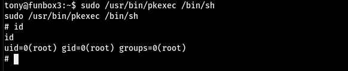  
  
#### Proof  
  
local.txt  
`74395882813e93aeb6a422e6dfb0618b`  
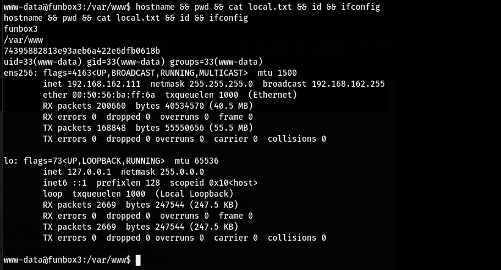  
  
proof.txt  
`93e8d166b41519f8859e66a83d7d497a`  
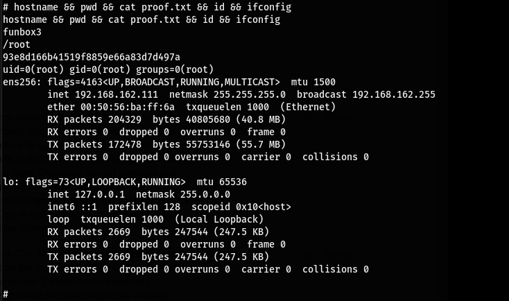