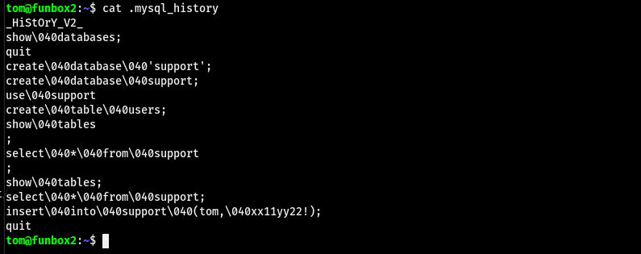

# FunboxRookie  
  
掃一下 感覺是要從FTP上傳東西再到網站拿webshell(?  
  
  
用anonymous連上去 沒有寫入的權限  
  
  
但拿FTP的版本去找exploit可以翻到有RCE的  
  
  
但可惜不能用  
  
  
嘗試把裡面的zip載下來看 發現可能是進入點 id_rsa包在有密碼的壓縮檔內  
  
  
把所有的zip下載下來用zip2john取hash 發現有幾個是可以爆出密碼的  
  
  
  
cathrine連不上去  
  
  
tom可以 但發現是在一個被限制的shell內  
  
  
  
  
#### 提權  
  
發現.mysql_history有點肥  
  
  
貓他可以看到好像是tom的憑證的奇怪東西(?  
  
  
嘗試sudo 發現去掉040可以過驗證 而且sudo還能ALL 直接`sudo su`就是root了  
  
  
#### Proof  
  
local.txt  
`63e4802a0c92e631b4755db78602e22a`  
  
  
proof.txt  
`f720af6ecf3dbdb082e2bef3614a6262`  
  
