# Inclusiveness  
  
感覺21跟80很可疑  
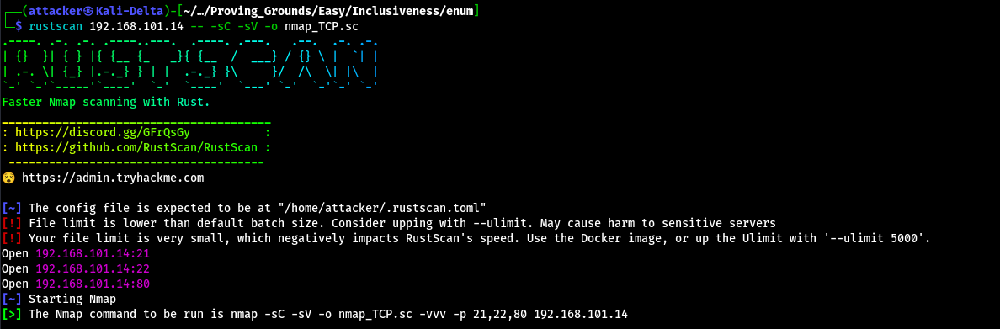  
  
FTP可以用anonymous連 裡面有一個叫pub的資料夾 可以寫入  
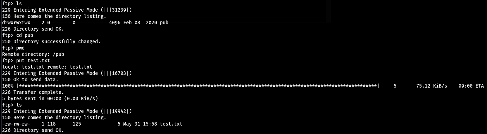  
  
掃一下路徑可以找到robots.txt 但連上去他會說你不是搜尋引擎 所以不給看  
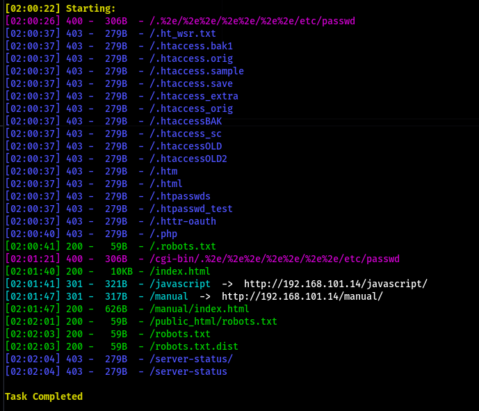  
  
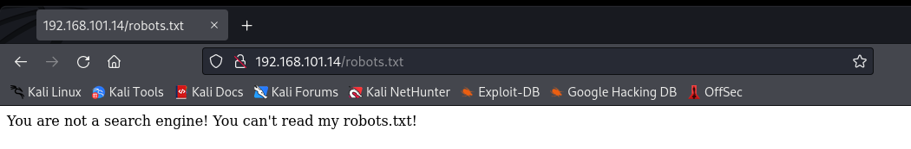  
  
把User-Agent改成Googlebot就過了 可以看到有一個叫`/secret_information/`的路徑  
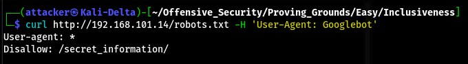  
  
連上後發現一個奇怪的網頁 有兩個可以點的東西 點english可以發現網址多一個奇怪的參數指向`en.php`  
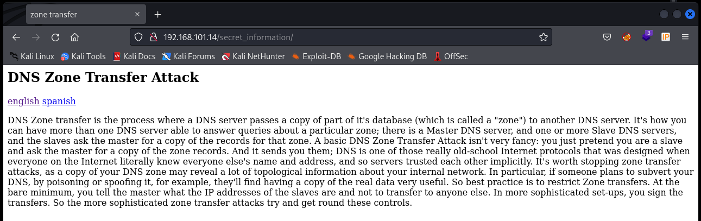  
  
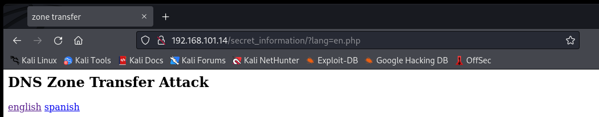  
  
用curl戳LFI 發現能把passwd戳出來 可以找到tom這個user  
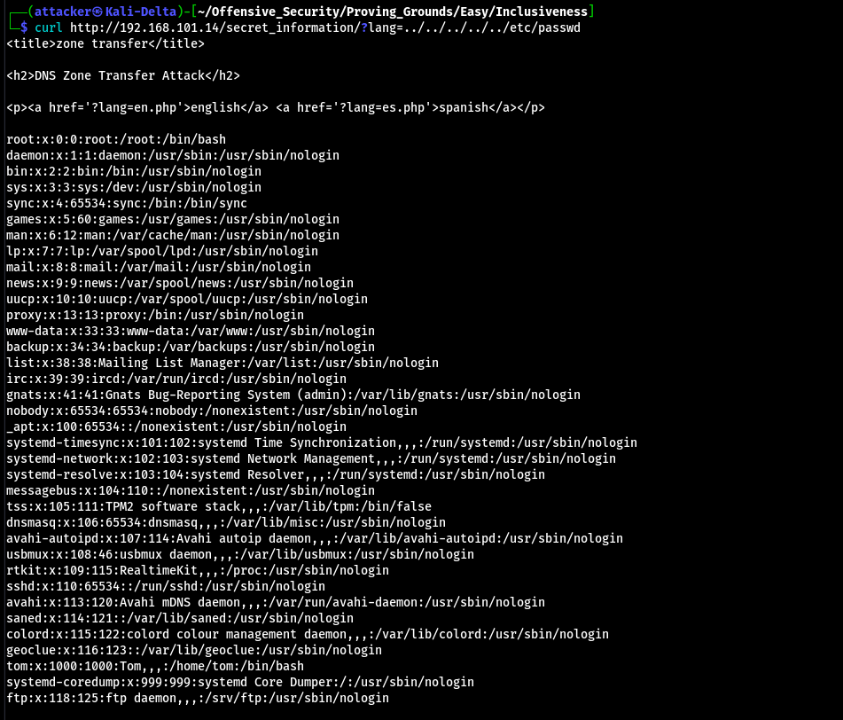  
  
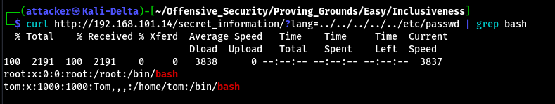  
  
突然想到剛剛FTP可以寫入 查一下vsftpd的預設路徑 發現是在`/var/ftp/` 直接LFI剛剛的`test.txt` 發現可以戳到  
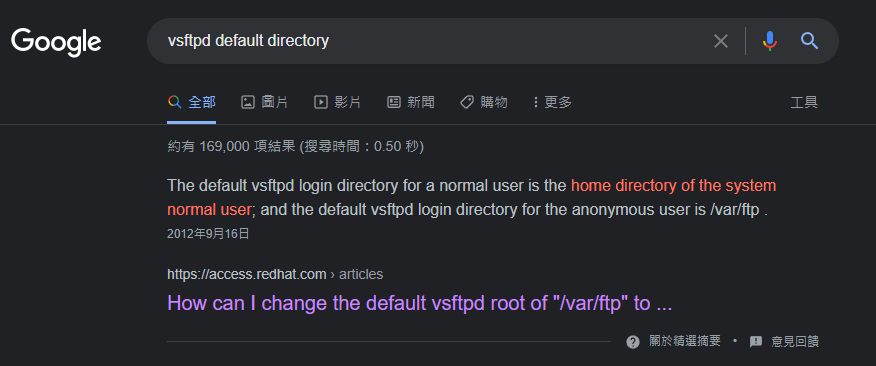  
  
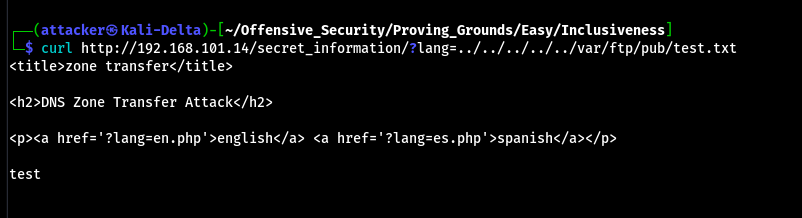  
  
寫一個webshell 丟過去以後LFI戳回來就RCE了  
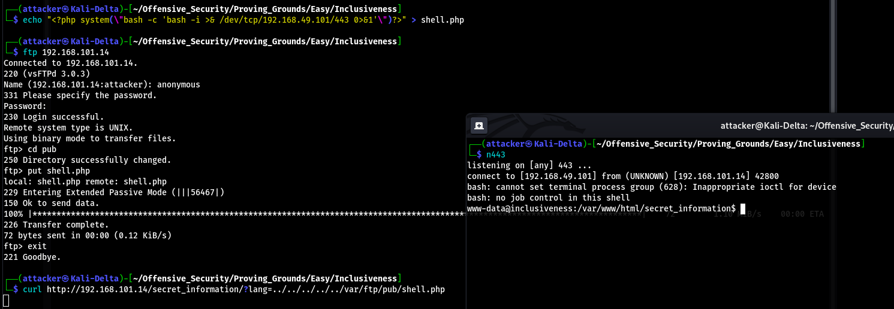  
  
#### 提權  
  
跑linPEAS 可以找到一個奇怪的SUID檔案在`/home/tom`  
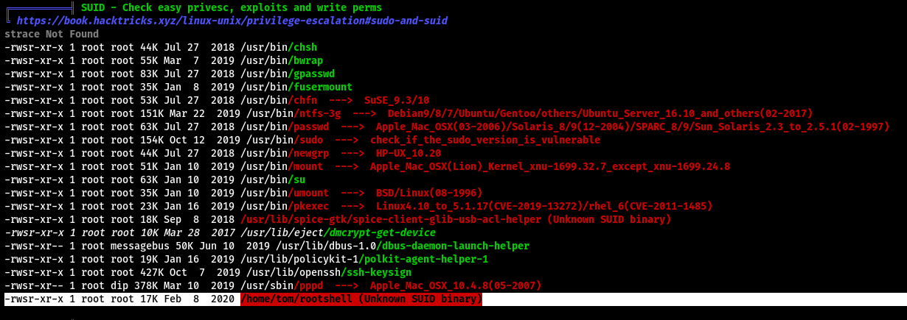  
  
在那個目錄下可以翻到他程式的原始碼 可以看到是用whoami來確認自己是不是tom 但whoami是相對路徑不是絕對路徑 所以這邊可以做Path Hijacking  
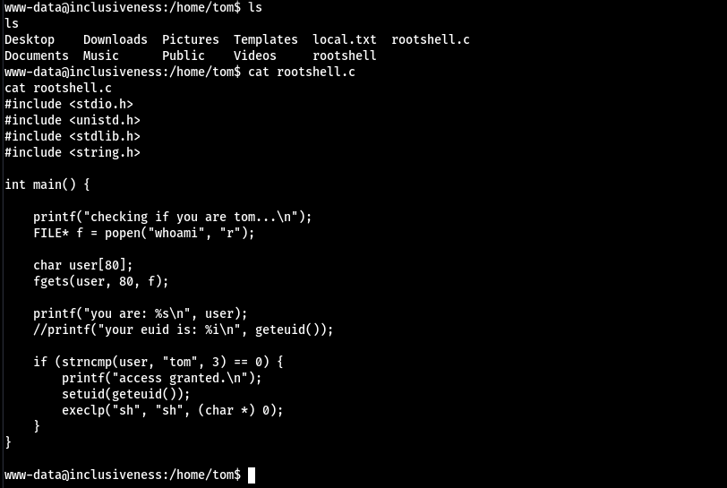  
  
先到`/tmp`下把`/bin/sh`塞到`whoami`裡面 然後加執行權限後執行rootshell 發現可以成功 但只能執行一次指令 輸出會丟到下面的you are: XXX 而且自己還是`www-data`的權限  
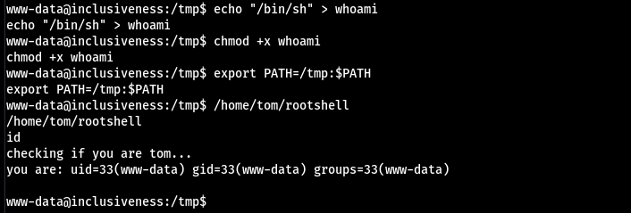  
  
嘗試如果`echo tom`的話能不能繞過限制 執行後發現可以繞過 但shell超級不穩定 所以額外再打一個reverse shell回來  
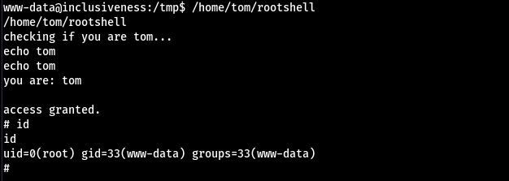  
  
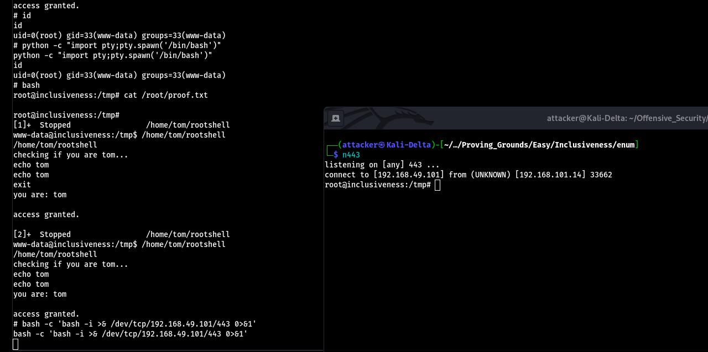  
  
#### Proof  
  
local.txt  
`483886136c534eb32eb117458ee53b19`  
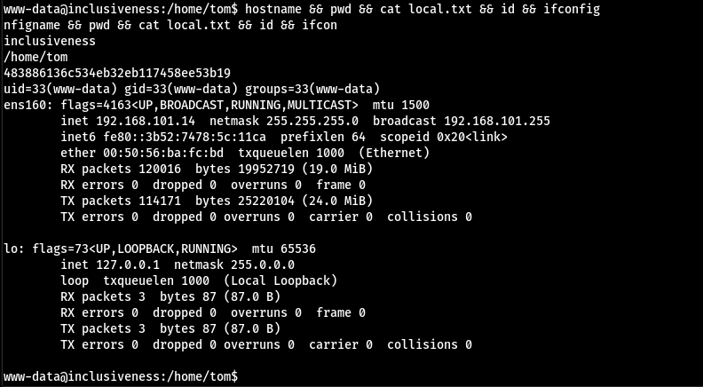  
  
proof.txt  
`45a4e161be01169037297f1ed76023a2`  
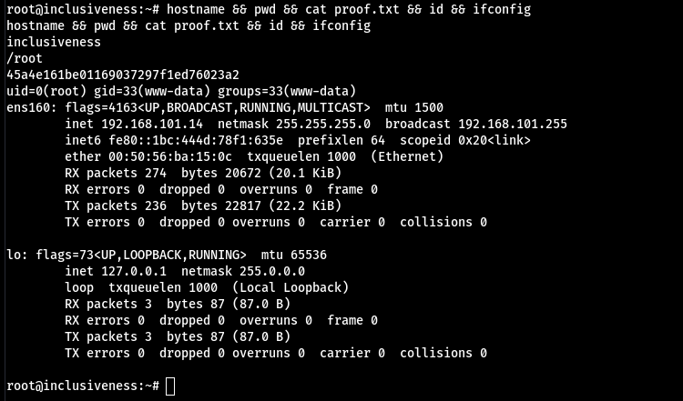