# InfosecPrep

掃一下發現開80跟33060 33060應該是MySQL 有點可疑
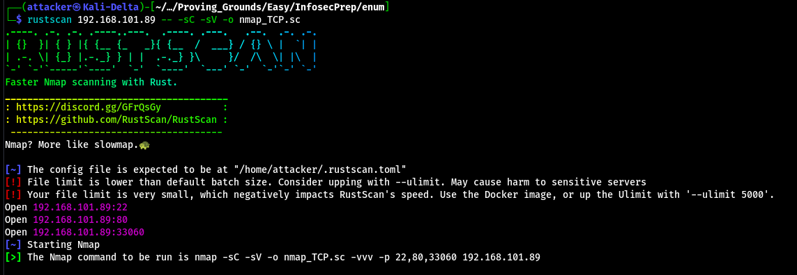

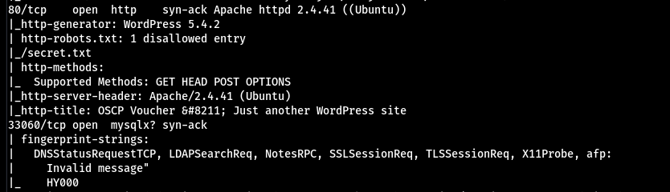

帶`-sC`下去掃能找到叫`/secret`的路徑 裡面是奇怪的base64 解碼後感覺是`id_rsa` 存下來
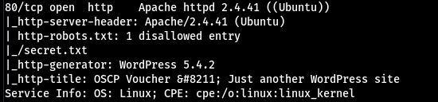

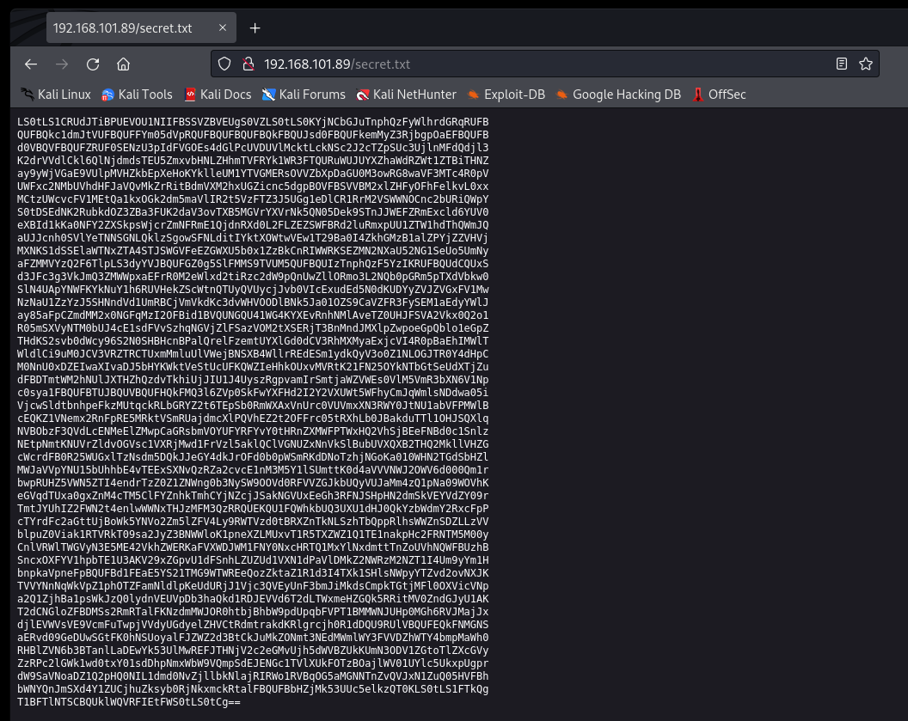

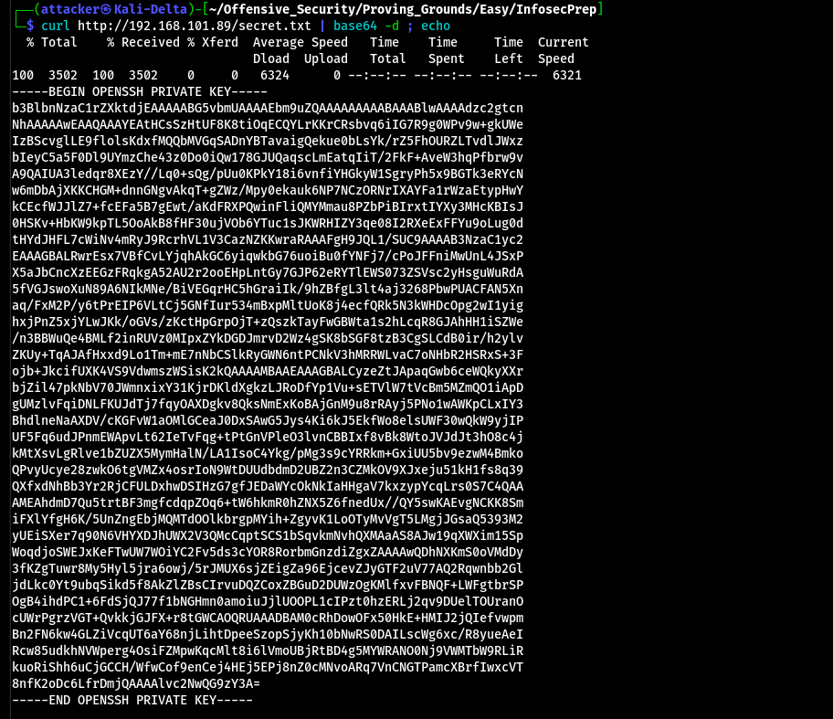

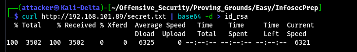

主頁面有說裡面有一個使用者叫`oscp` 把`id_rsa`加600權限後SSH上去就可以拿到初始shell了
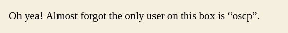

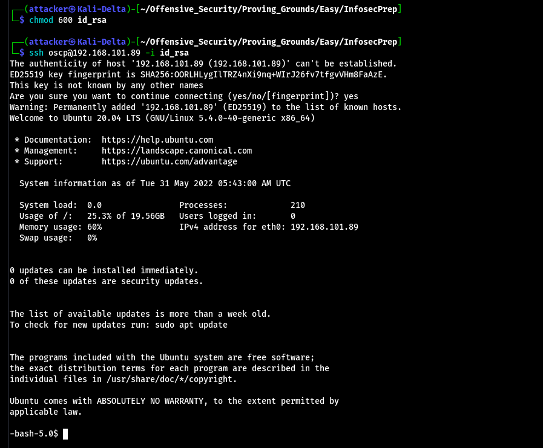

#### 提權

跑linPEAS發現bash有SUID 直接`bash -p`就是root了
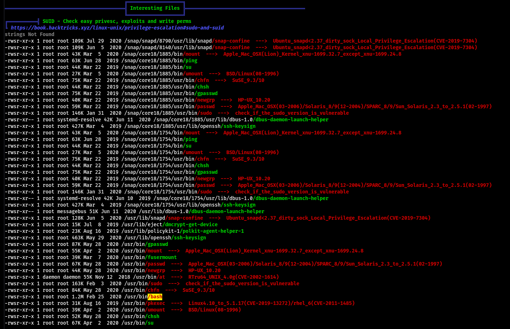

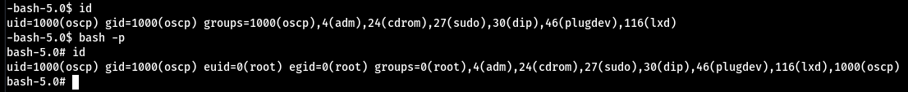

#### Proof

local.txt
`2b6ba7b604966d0d114e50bdb0fe8b5c`
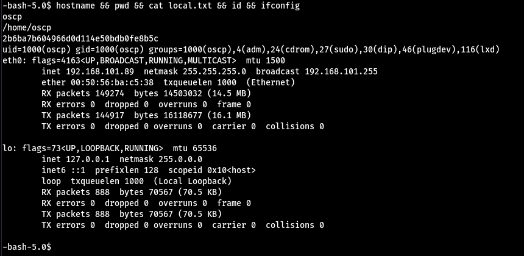

proof.txt
`1220b46928ede2add90023f958a3001f`
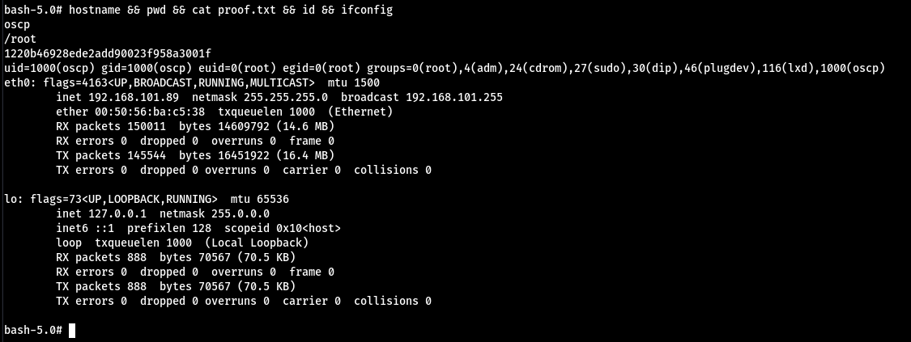