### Katana  
  
這台看起來比較酷一點  
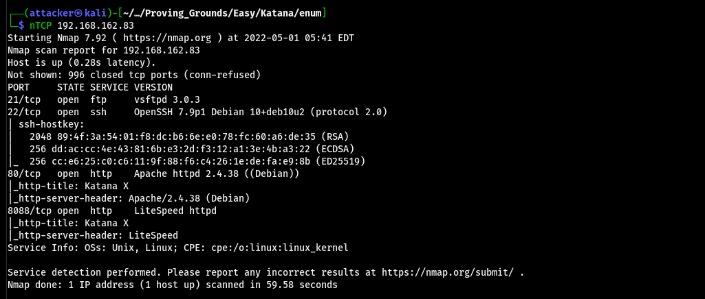  
  
感覺8088很可疑 先掃他路徑 看起來是進入點  
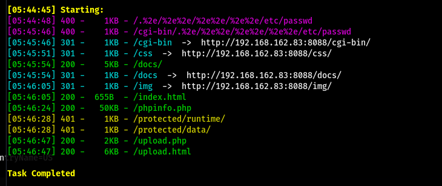  
  
`upload.html`看起來可以丟檔案上去  
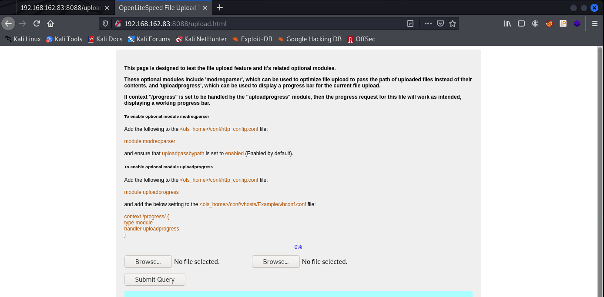  
  
手寫一個webshlel上傳 會塞到某`/html/`下 感覺從根目錄就能訪問到 但他說要等一分鐘  
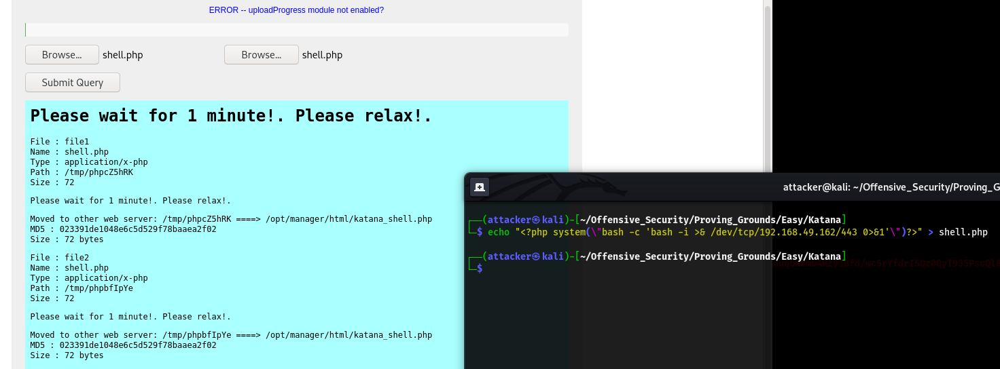  
  
等一分鐘後嘗試訪問根目錄+katana_shell.php 但看起來沒什麼效果  
  
掃全Port多出來幾個比較奇怪的 再針對下去掃發現都是web server  
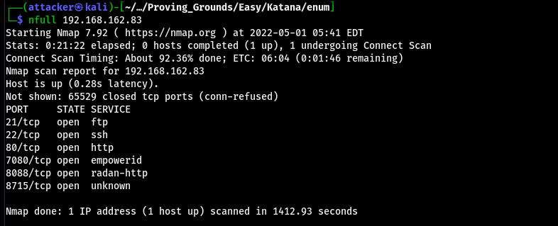  
  
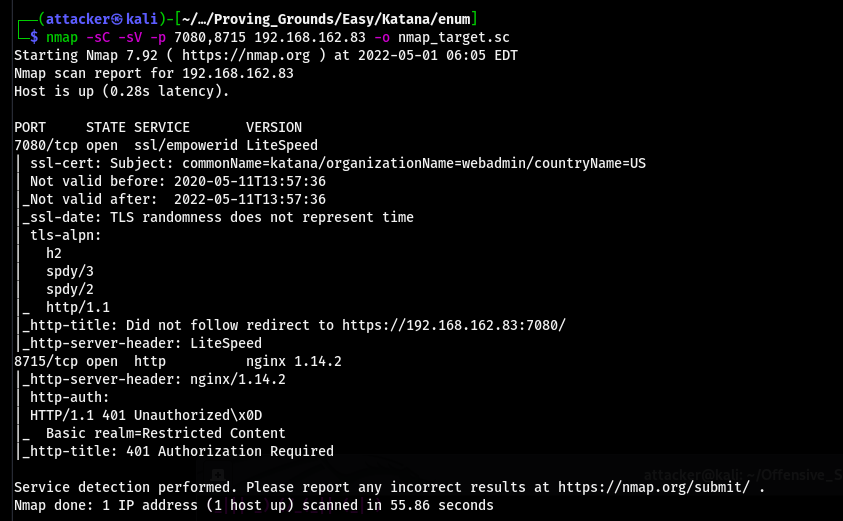  
  
突然想到有沒有可能是開不同的web server 然後其中一個是能訪問到剛剛丟的shell.php的  
  
稍微試了一下 發現在8715的根目錄能訪問到剛剛丟的katana_shell.php  
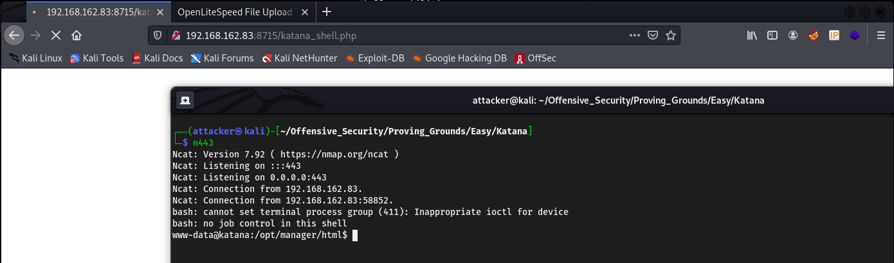  
  
#### 提權  
  
跑linPEAS 發現python有setuid的cap  
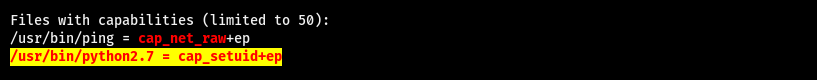  
  
用python生成UID=0的shell就是root了  
`python -c "import os;os.setuid(0);os.system('/bin/bash')"`  
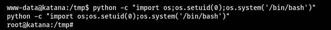  
  
#### Proof  
  
local.txt  
`6096a9bb5e9e2e9f9e78aaf49dce1169`  
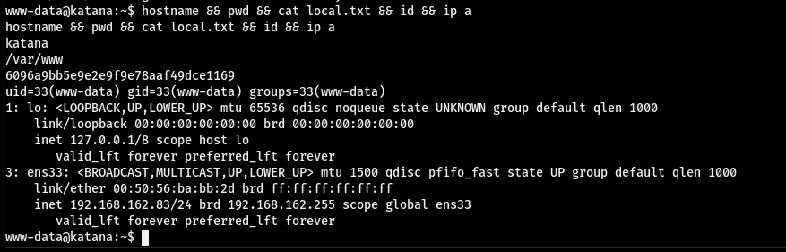  
  
proof.txt  
`c877ec593d8fe8b7833cb97184dec76a`  
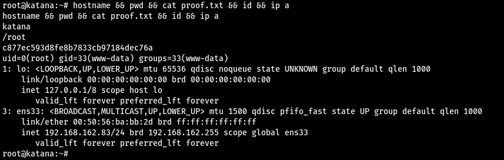  
