# Lampiao  
  
感覺1898超級可疑  
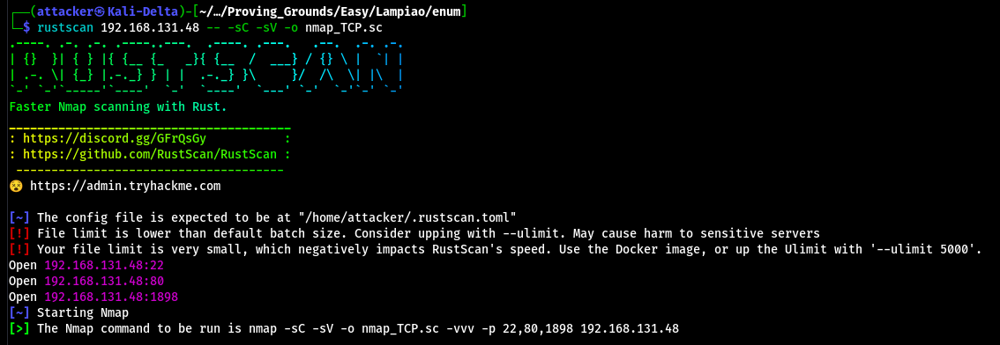  
  
掃一下是HTTP Server  
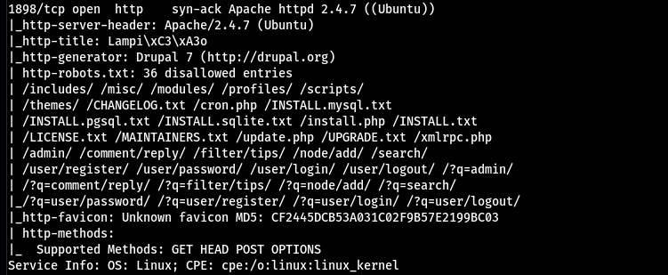  
  
80好酷 感覺進入點可能不是這邊  
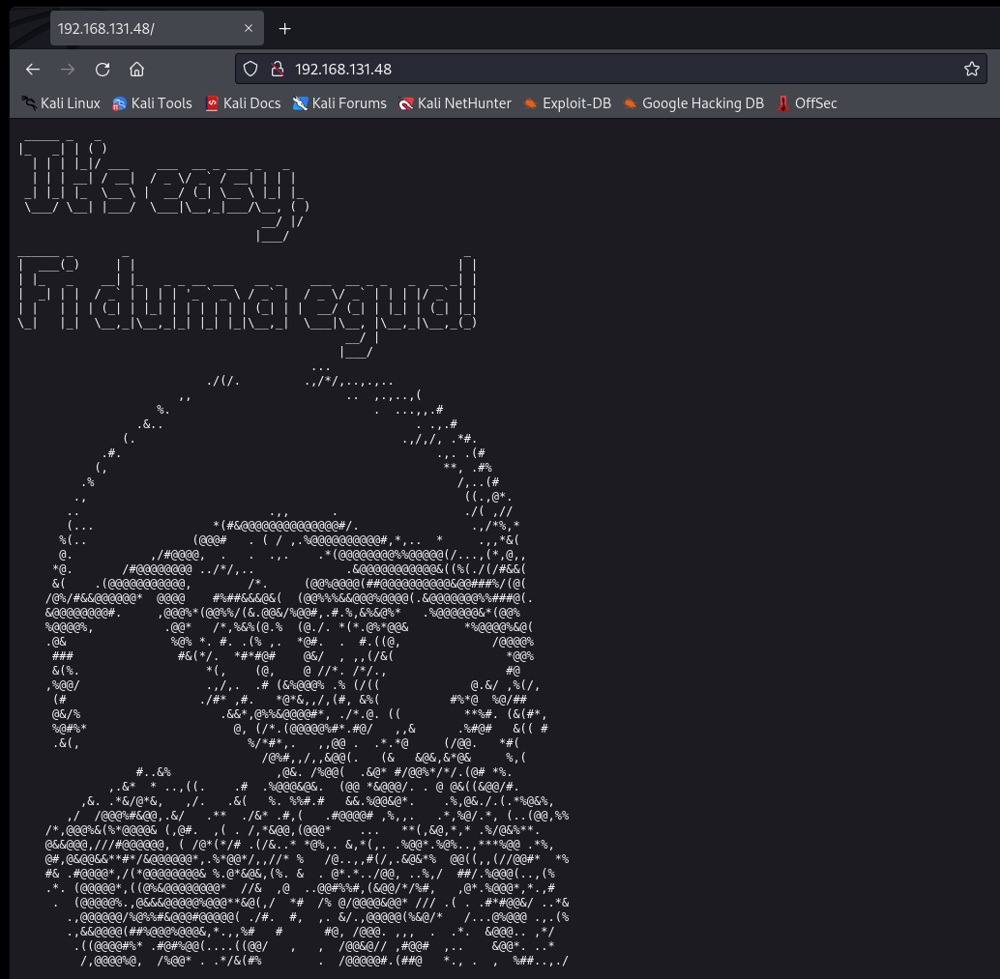  
  
1898開著Drupal 7 利用這個資訊去找Exploit可以找到一個  
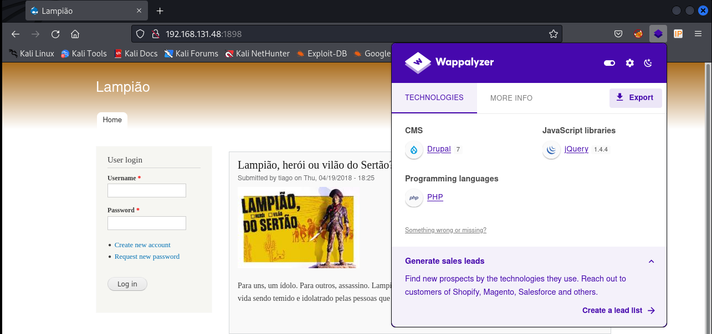  
  
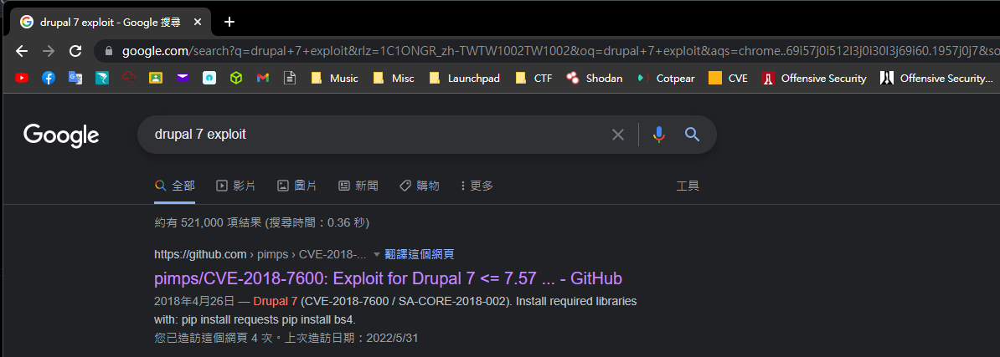  
  
把它載下來直接run就拿到initial shell了  
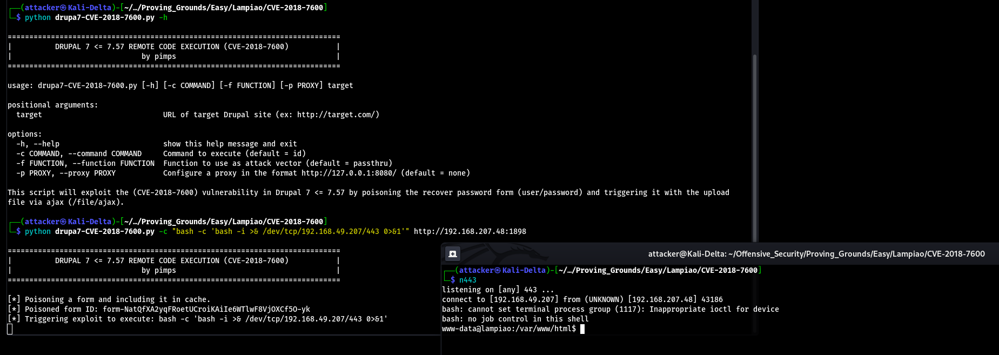  
  
#### 橫向提權  
  
跑linPEAS可以看到一個密碼 裡面有一個叫tiago的使用者 直接su就變成他了`tiago:Virgulino`  
  
  
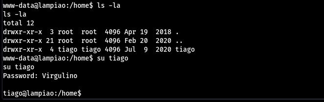  
  
#### 垂直提權  
  
跑linPEAS可以看到是易受攻擊的Kernel 用searchsploit可以找到一大坨exploit  
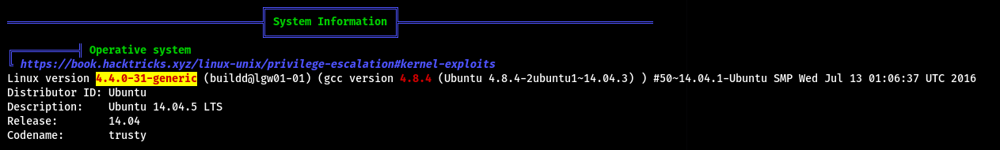  
  
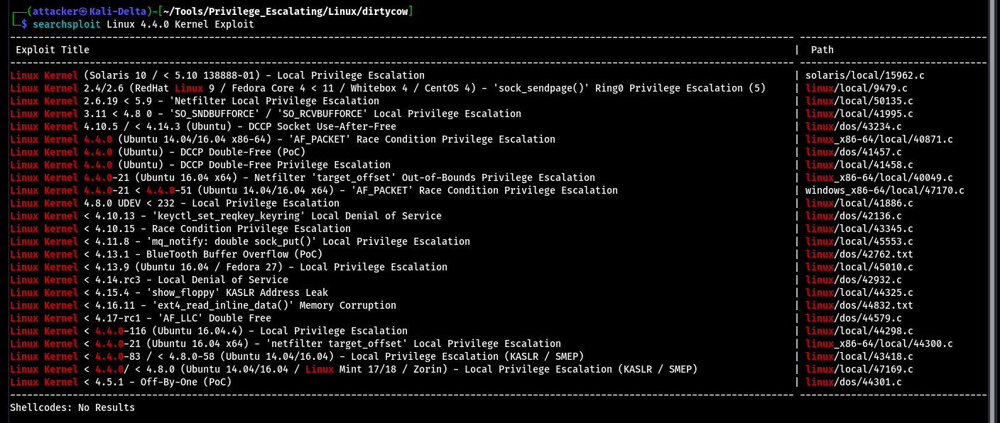  
  
載下來直接編譯的話會噴錯 改PATH可以解決 但還是噴錯  
`export PATH=/usr/local/bin:/usr/local/sbin:/usr/bin:/usr/sbin:/bin:/sbin`  
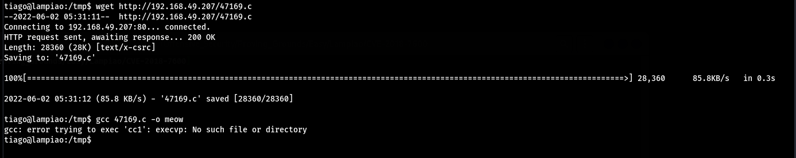  
  
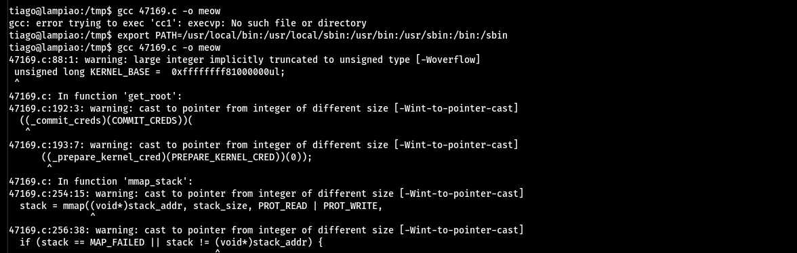  
  
最後把清單上的exploit都戳過 但都爛掉 最後找到一個另一版的linux exploit suggester 翻到一堆exploit  
https://github.com/mzet-/linux-exploit-suggester  
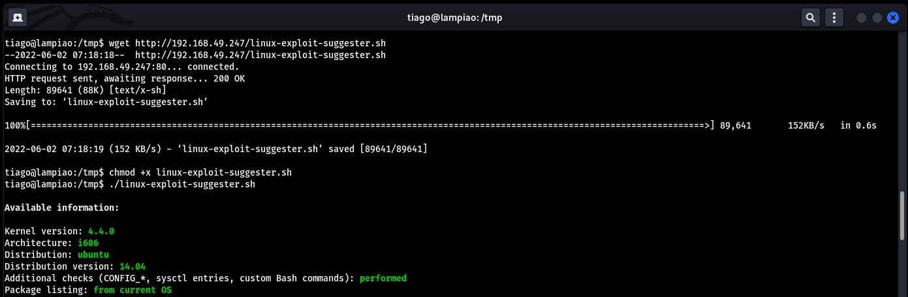  
  
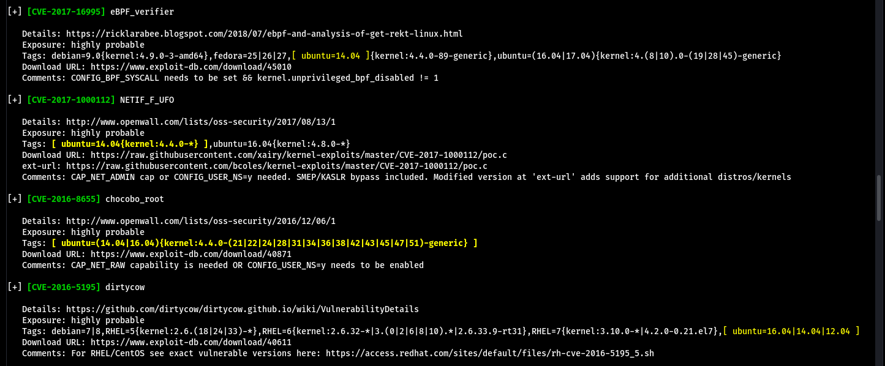  
  
最後用了dirtycow 2的ext-url exploit 編譯以後執行就成功root了  
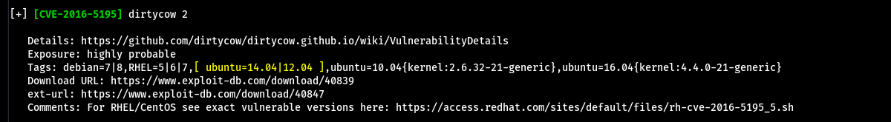  
  
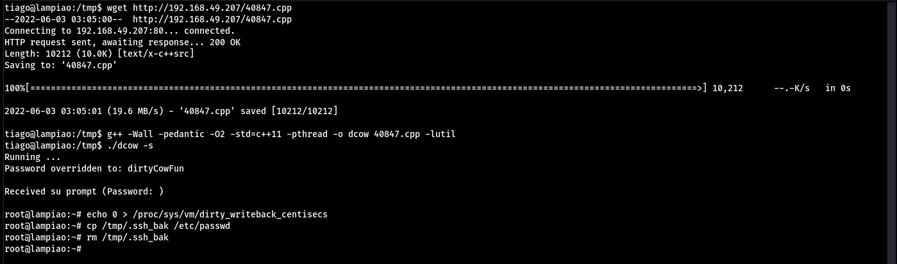  
  
#### Proof  
  
local.txt  
`569a509bad162e12796cc5d58b4deffd`  
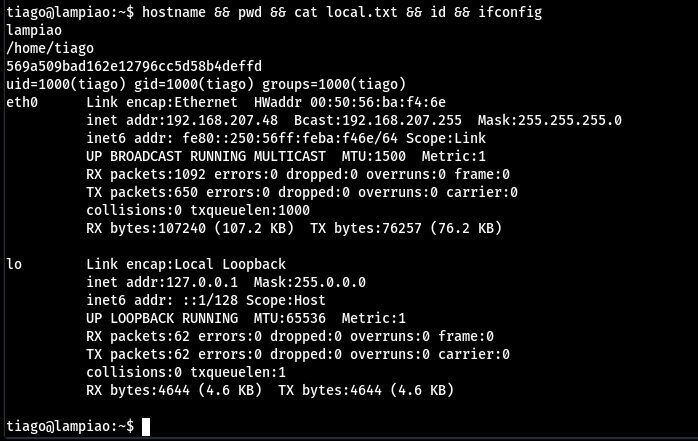  
  
proof.txt  
`137a048a9cb1e0d72e7087ad6ef54e31`  
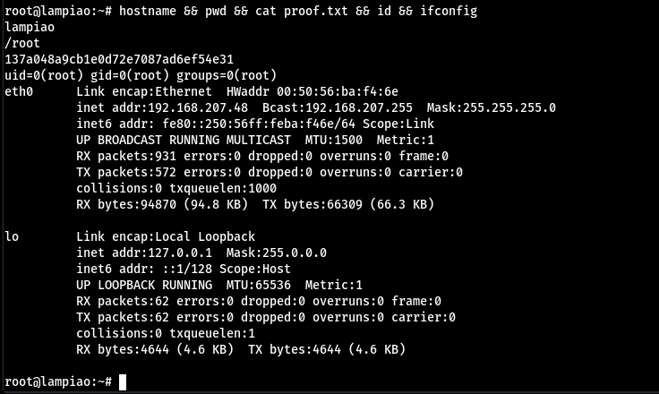