# Sumo  
  
純Web(?  
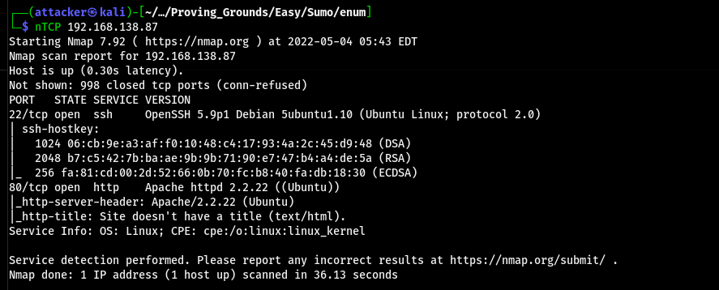  
  
連上後不知道為什麼都枚舉不到東西 直到用了`cgis.txt`這個wordlist掃才掃到一個`test.cgi`  
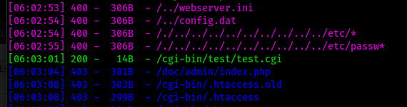  
  
嘗試看看直接戳ShellShock 用Burp把封包抓下來改User-Agent  
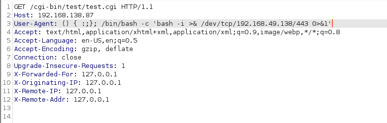  
  
丟過去以後就成功RCE了  
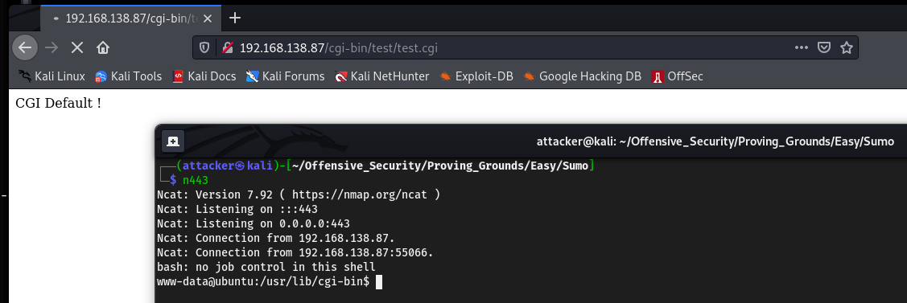  
  
#### 提權  
  
跑linPEAS 看了這個Kernel的版本直接想到37292.c 查了一下 看來這次能用用看33589.c  
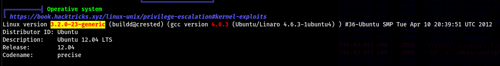  
  
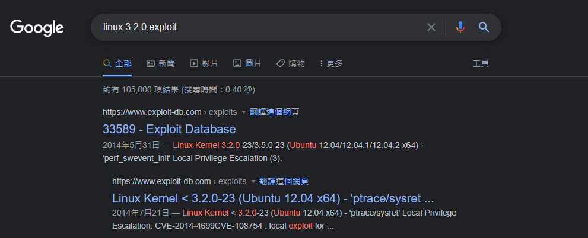  
  
把exploit丟過去 編譯爛掉 改一下PATH就能解決 但exploit執行還是爛掉  
`export PATH=/usr/local/bin:/usr/local/sbin:/usr/bin:/usr/sbin:/bin:/sbin`  
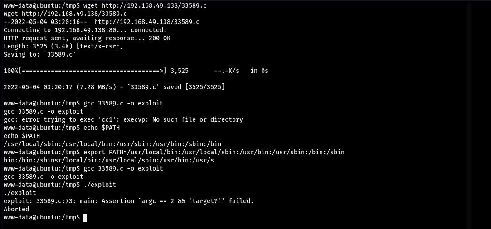  
  
接下來把LSE上面的清單全部試一次都沒有用QQ  
  
用searchsploit查Kernel Exploit 然後一個一個試 最後用`40839.c`成功提到root  
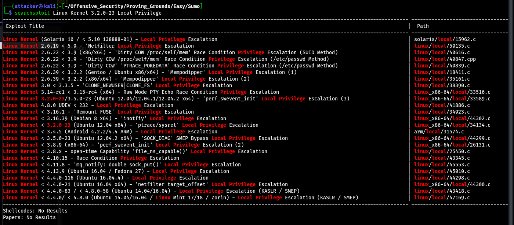  
  
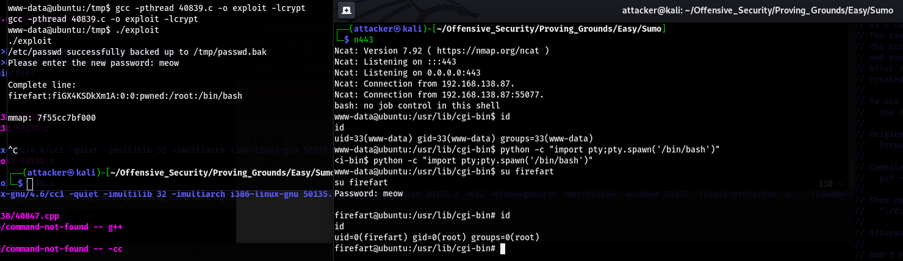  
  
#### Proof  
  
local.txt  
`6da4f513dd3240ca085a12e5fc2d3dc2`  
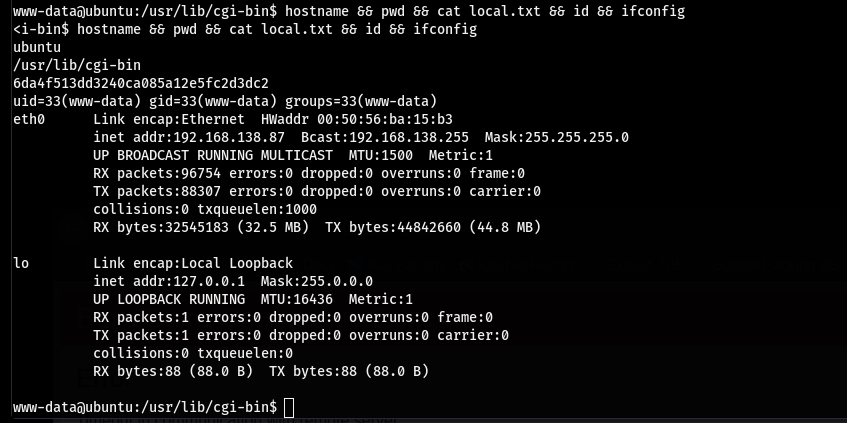  
  
proof.txt  
`728ffa7fe36c65259ba6d38d7886137c`  
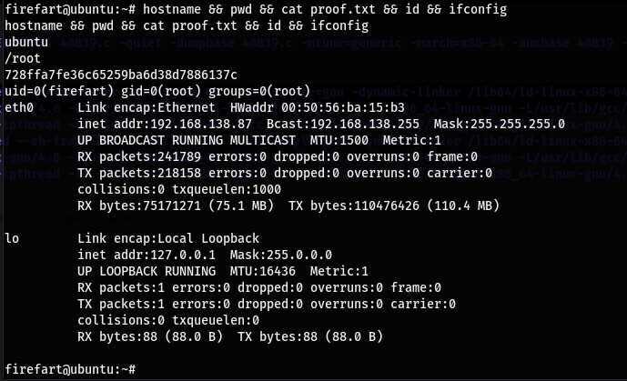