### SunsetDecoy  
  
看起來是純web  
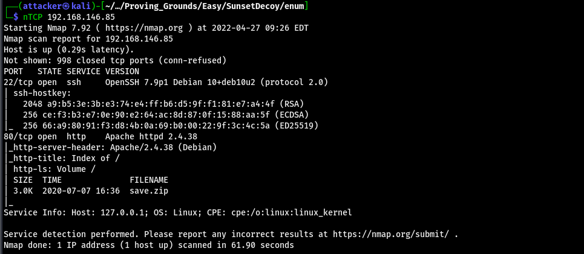  
  
連上去能發現一個save.zip  
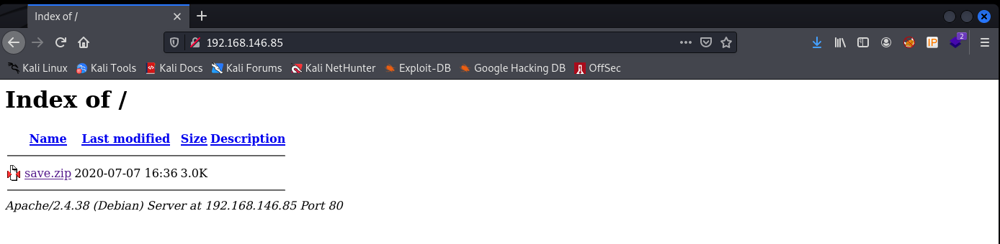  
  
載下來發現解壓縮需要密碼  
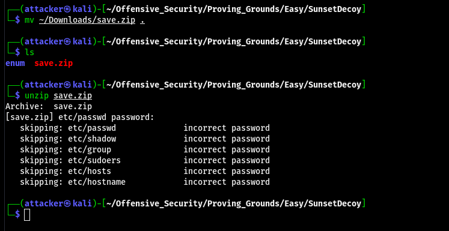  
  
zip2john取hash後再爆 直接噴密碼出來  
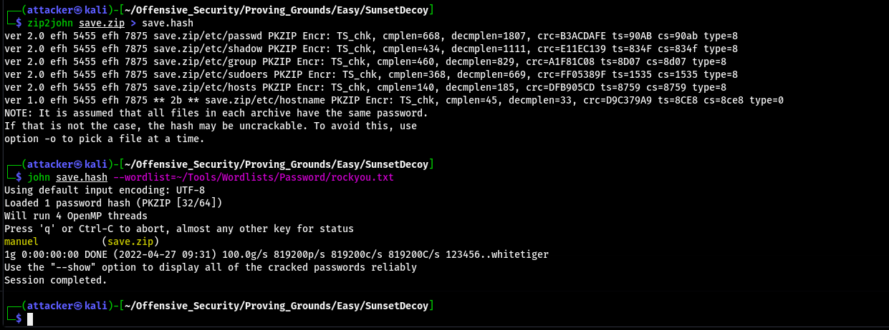  
  
可以看到有shadow 拿john炸能噴一個名字很長的使用者的密碼出來  
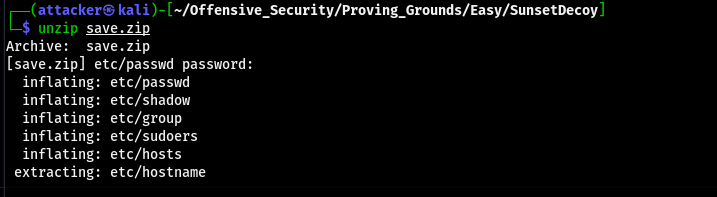  
  
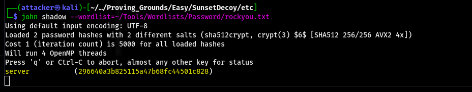  
  
可以直接連上去 但發現又是被限制的shell  
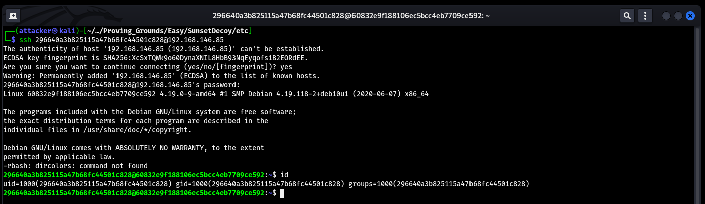  
  
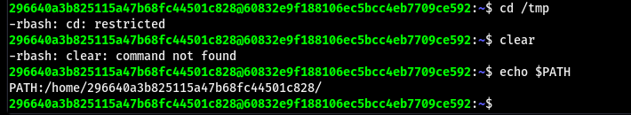  
  
能用的東西不多 ~~而且這名字真的好麻煩~~  
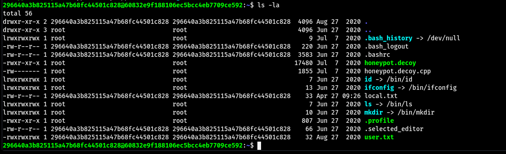  
  
#### 提權  
  
最後發現在SSH後面加上一條指令才能繞過  
`ssh 296640a3b825115a47b68fc44501c828@192.168.146.85 -t "bash -noprofile"`  
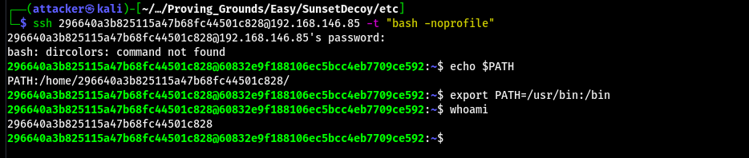  
  
在/home有一個很奇怪的ELF 執行以後會有很多種選項  
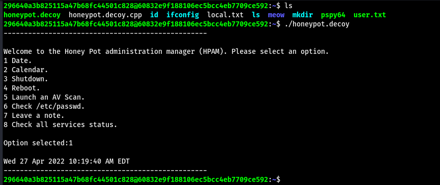  
  
因為之前做過一個linux AV的Local Privilege Escalation 所以看到這個AV scan感覺有點機會  
  
把pspy64丟到對面的機器上 然後再選AV scan 可以看到是chkrootkit 0.49在掃  
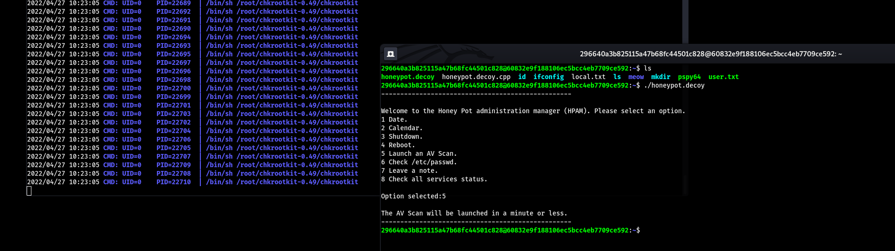  
  
可以找到一個exploit 跟之前HackTheBox的那台一樣  
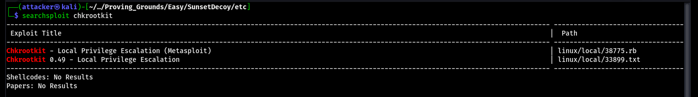  
  
把reverse shell塞到/tmp/update加上執行權限後就能root了  
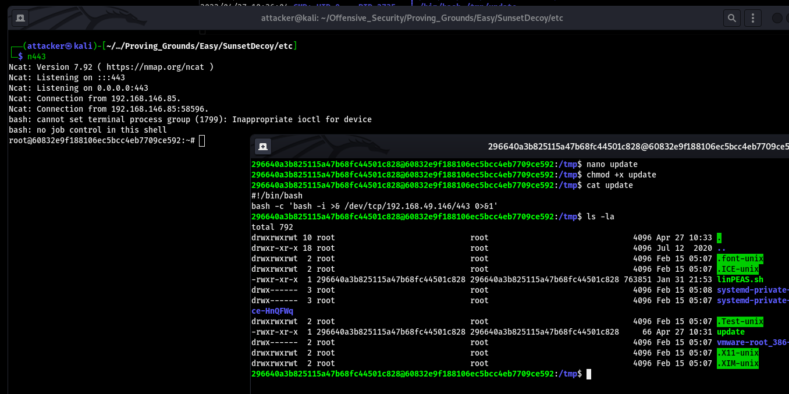  
  
#### Proof  
  
local.txt  
`1d79be2f9593b2439285da0953de4112`  
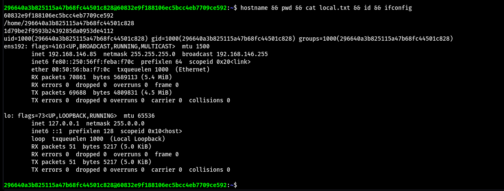  
  
proof.txt  
`60c622311bc1d325d5ea006d709705f4`  
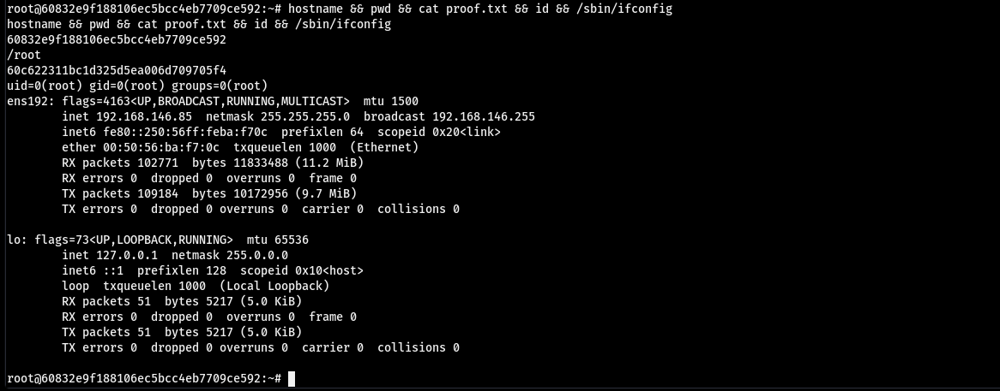