### CyberSploit1

看起來還是Web
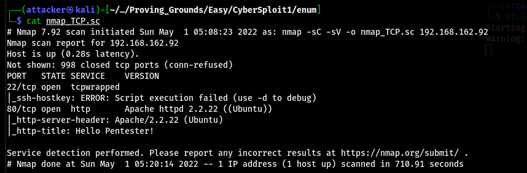

拿dirsearch掃一下可以翻到一堆東西
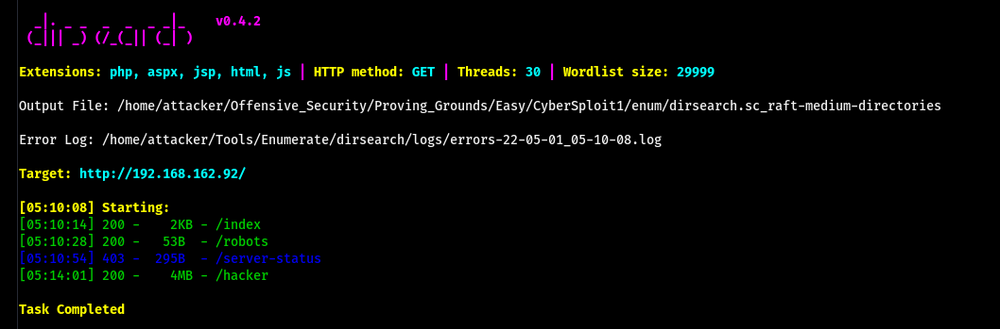

到robots上可以看到一串base64 解密以後發現是yt連結(?
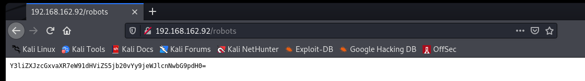

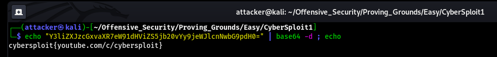

???酷
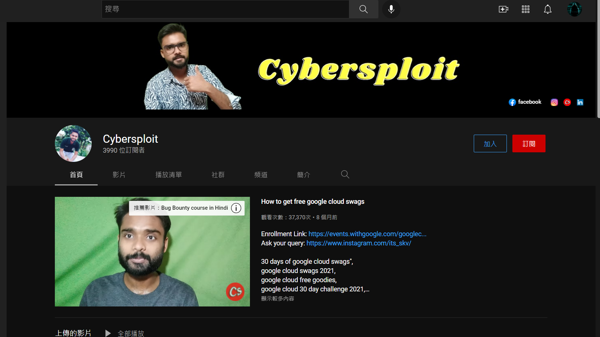

在初始頁面的原碼可以翻到一個username
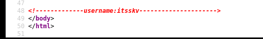

但之後一直沒有進展 查了Write up以後發現要把剛剛拿到的flag當密碼登入SSH 什麼垃圾設計==

#### 提權

跑linPEAS 發現可能可以打Kernel Exploit
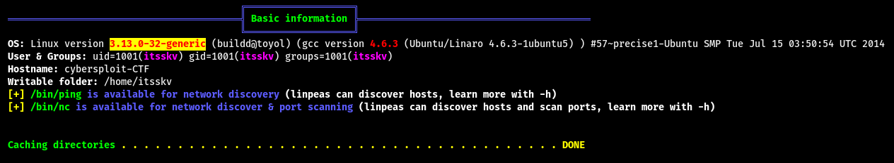

查了一下 是熟悉的37292.c 丟過去編譯後執行就是root了
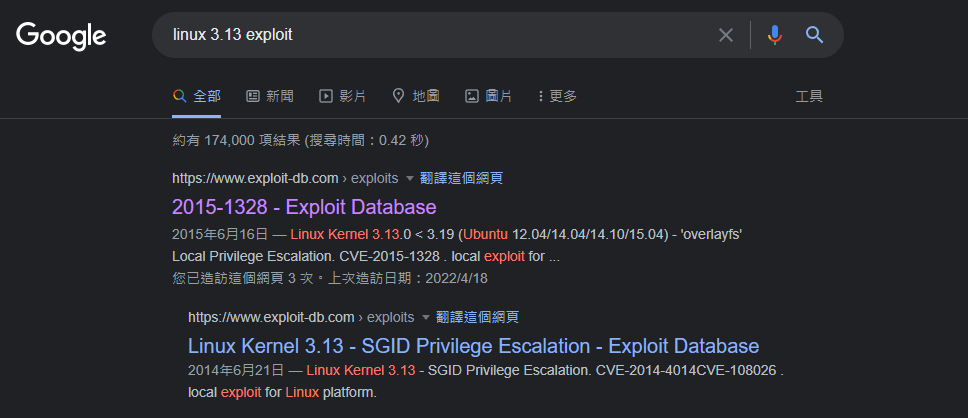

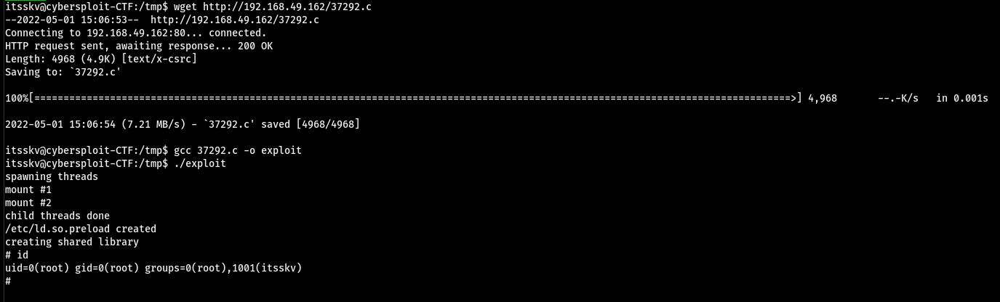

#### Proof

local.txt
`4396508ea25ba0a5e4913b77d9881f48`
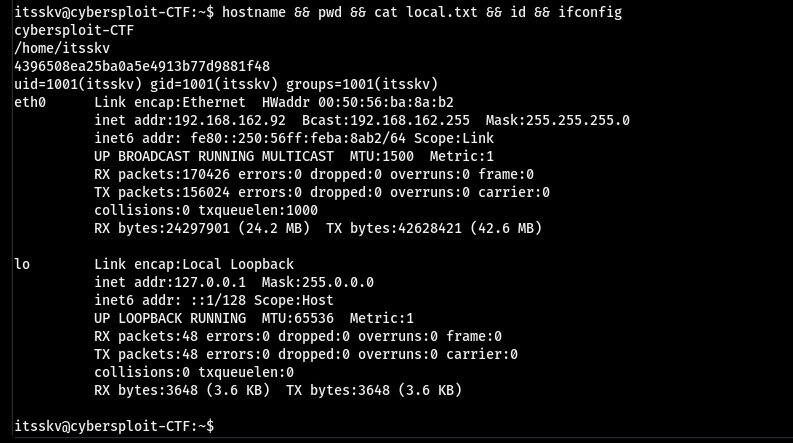

proof.txt
`6302baed564ff9c2a9c33cdab245d0ea`
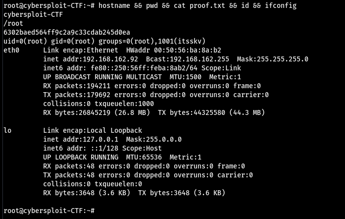