### Gaara

怎麼PG都是打Web
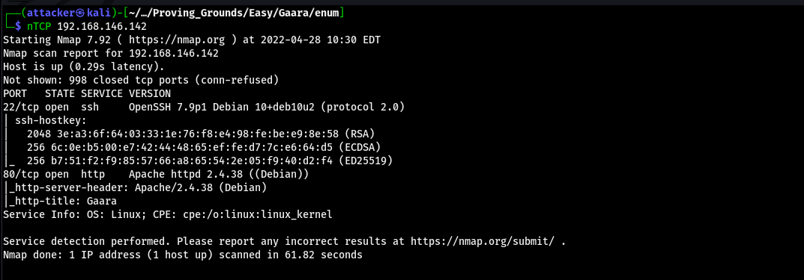

不知道為什麼都枚舉不到路徑 直到用了directory-list-2.3-big.txt這個wordlist才找到
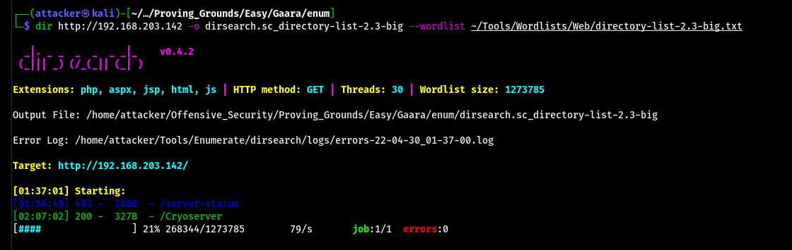

拉到最下面可以看到三條路徑 打開以後都是一串長到吐的文章 到這邊線索就斷了 直到看了Write up才知道要在這堆文章中翻出一行encode過的文字 (這什麼垃圾設計==
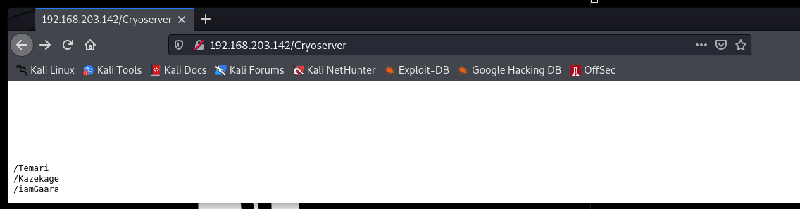

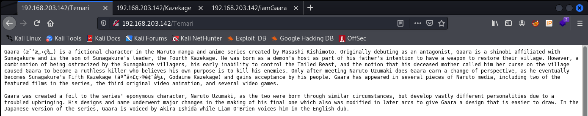

`curl http://192.168.203.142/iamGaara | grep -oE '\w+' | sort -u -f | more`
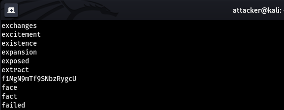

拿CyberChef用base58解可以噴出一串憑證
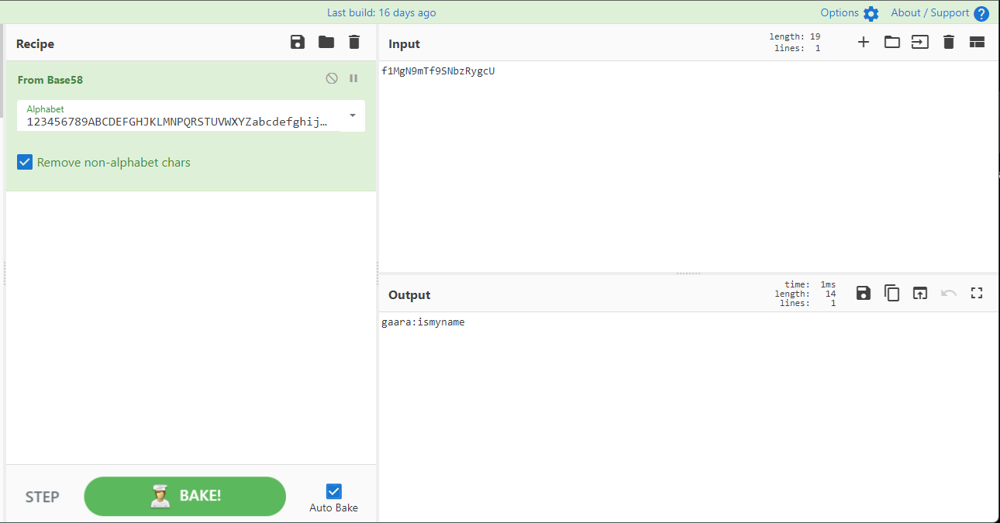

但這個憑證是無效的 不過至少我們拿到了username 用hydra炸一下就噴出來了
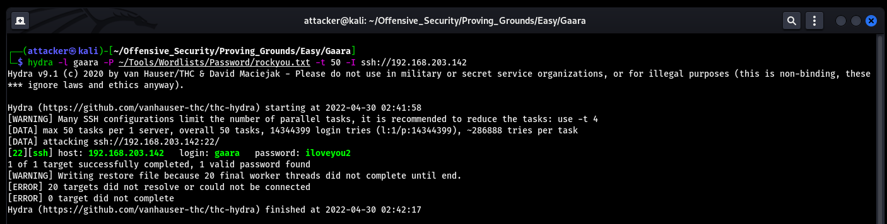

成功登入
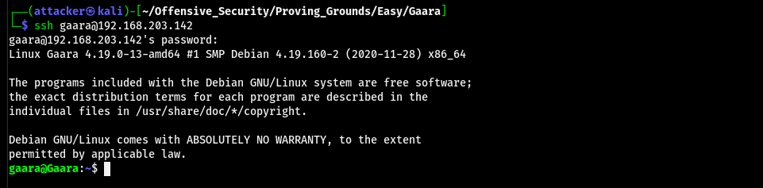

#### 提權

進去以後跑linPEAS 可以看到gdb有SUID 直接查GTFOBins就能翻到生shell的指令 輸入就直接root了
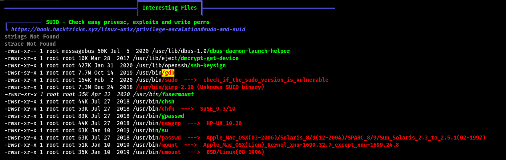

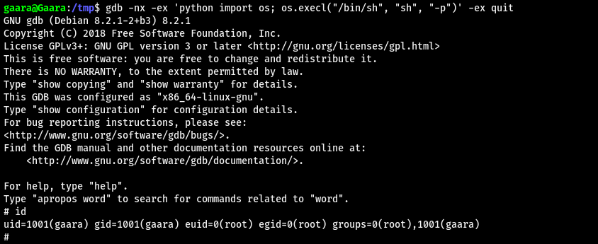

#### Proof

local.txt
`4e63c838b940d3a9476e7acde72b409f`
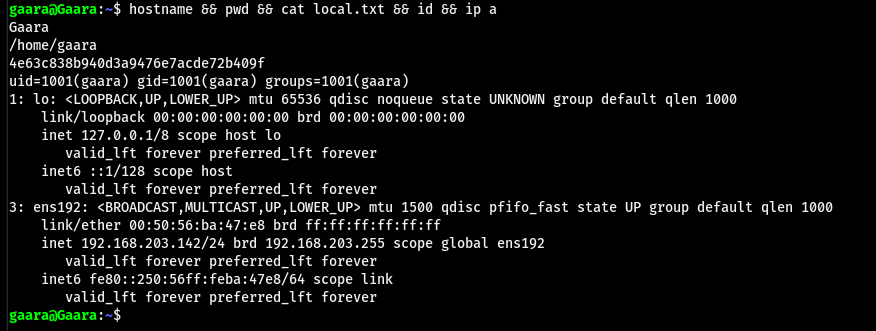

proof.txt
`0aeda9dd270f8b39e99c463c1b0df05f`
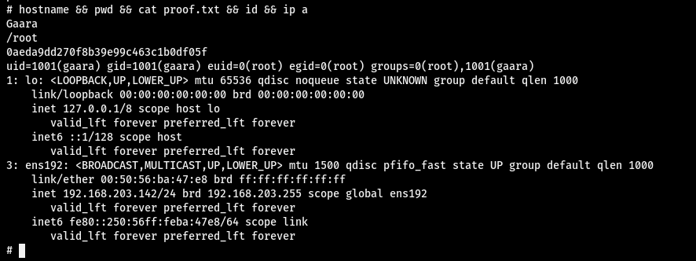