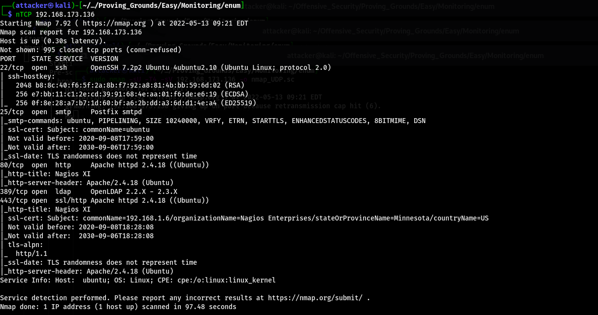
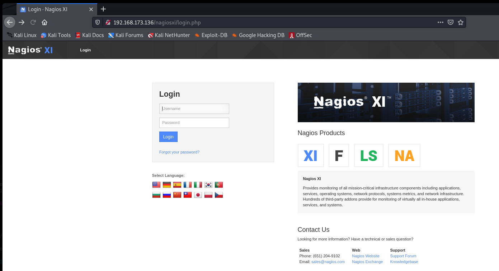
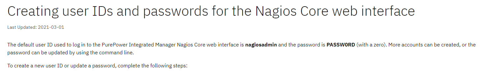
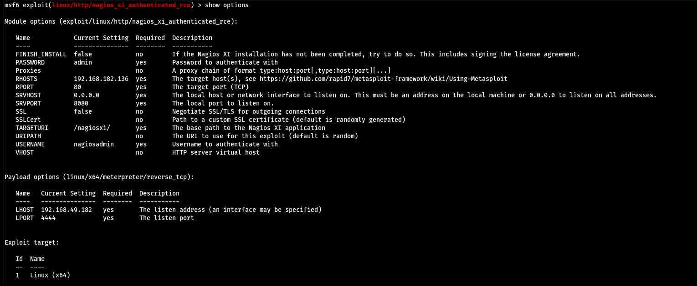
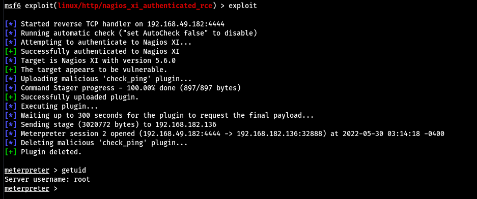
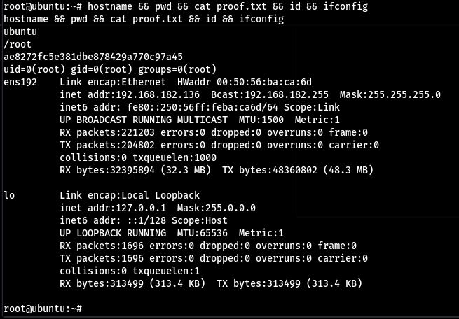

# Monitoring

看起來是80 但389看起來也蠻可疑的

在`/nagiosxi`有一個登入介面 找一下預設的憑證 可以知道是`nagiosadmin`

https://www.ibm.com/docs/en/power8?topic=POWER8/p8ef9/p8ef9_ppim_nagios_userid.htm

但預設的憑證無法登入 多試幾組就能進了 但好像進到一個奇怪的網頁`nagiosadmin:admin`

之後查了很多exploit都不能用 最後看了Write up後發現只能用Metasploit解 運行以後就直接是root了

#### Proof

proof.txt
`ae8272fc5e381dbe878429a770c97a45`
