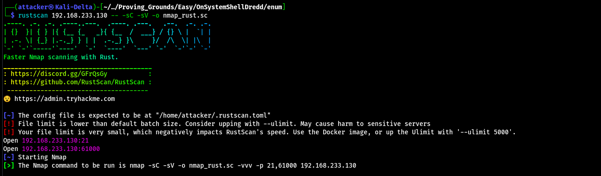
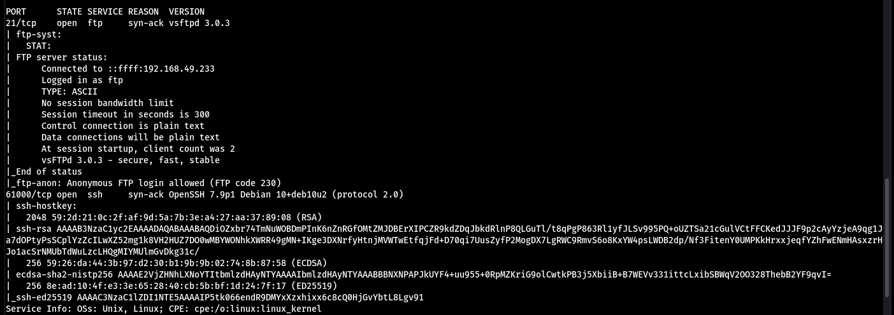
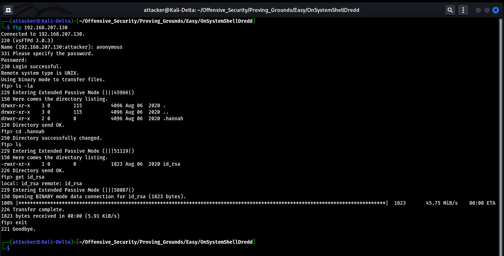
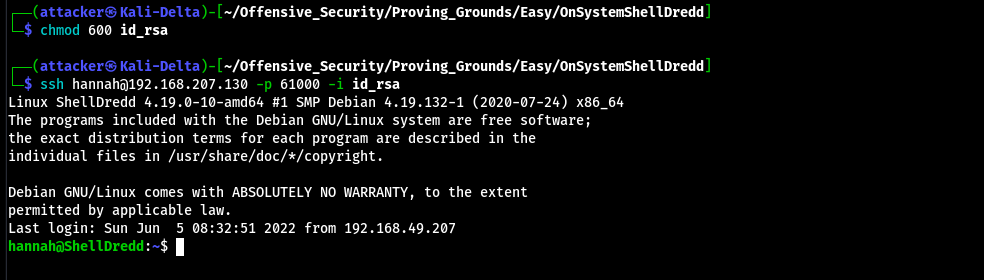
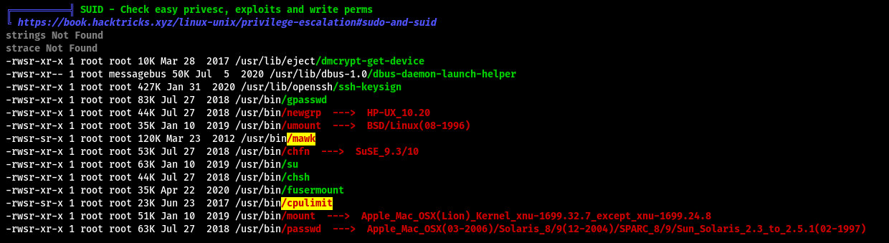
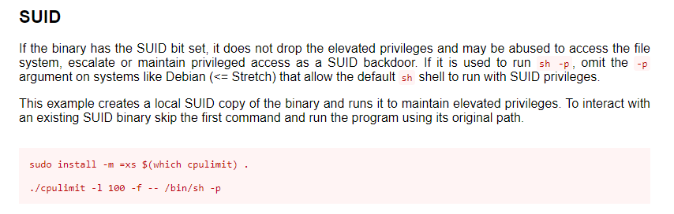
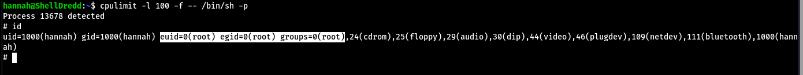
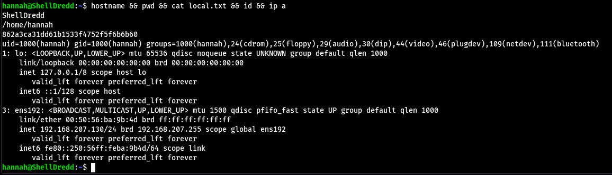
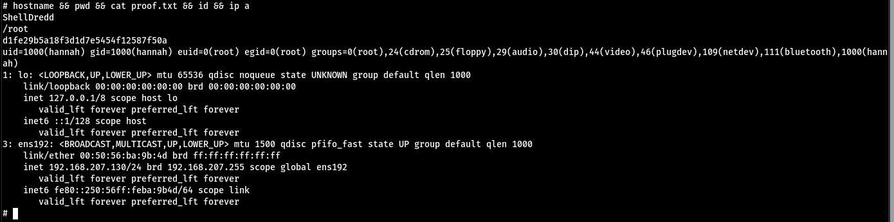

# OnSystemShellDredd

奇怪的開Port

這兩個東西我記得都是沒有漏洞的耶:(

FTP上去可以翻到一個id_rsa 給權限600後直接SSH剛剛資料夾的名字就拿到shell了

#### 垂直提權

跑linPEAS 發現有兩個SUID檔案超級可疑 GTFOBins找cpulimit可以翻到一個SUID Base的payload

打進去就root了

#### Proof

local.txt
`862a3ca31dd61b1533f4752f5f6b6b60`

proof.txt
`d1fe29b5a18f3d1d7e5454f12587f50a`
