# Photographer

感覺兔子洞有點多
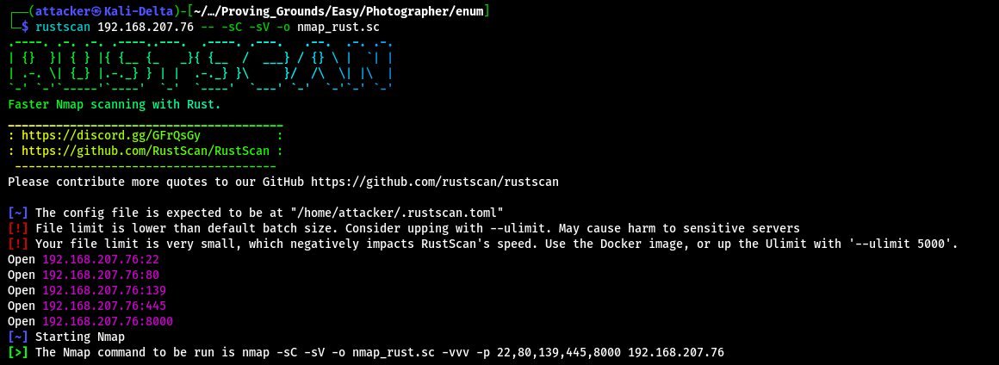

Samba裡面有兩個檔案 mailsent.txt裡面可以看到應該有一個user叫Daisa 另一個是wordpress的備份
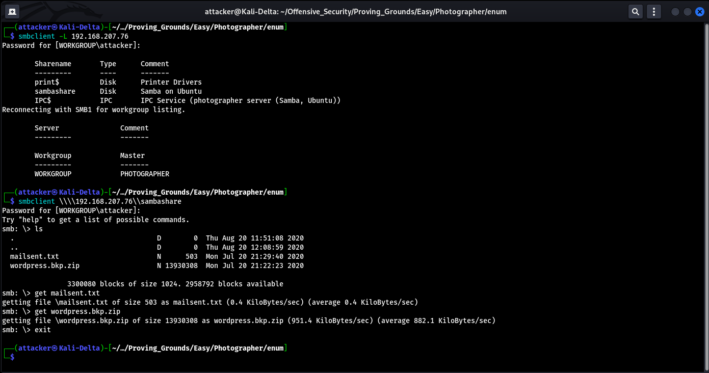

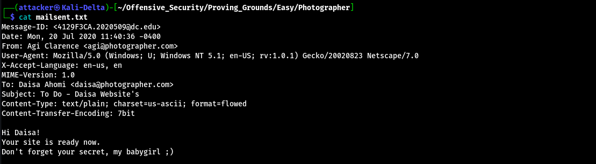

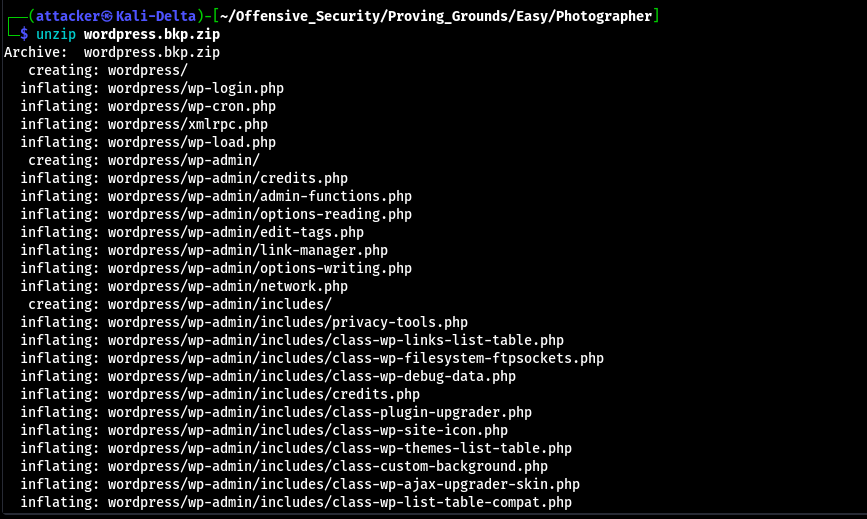

對8000掃下去以後發現幾個可疑的目錄 連上admin後發現是Koken CMS 0.22.24 拿searchsploit找可以翻到一個Authenticated的exploit
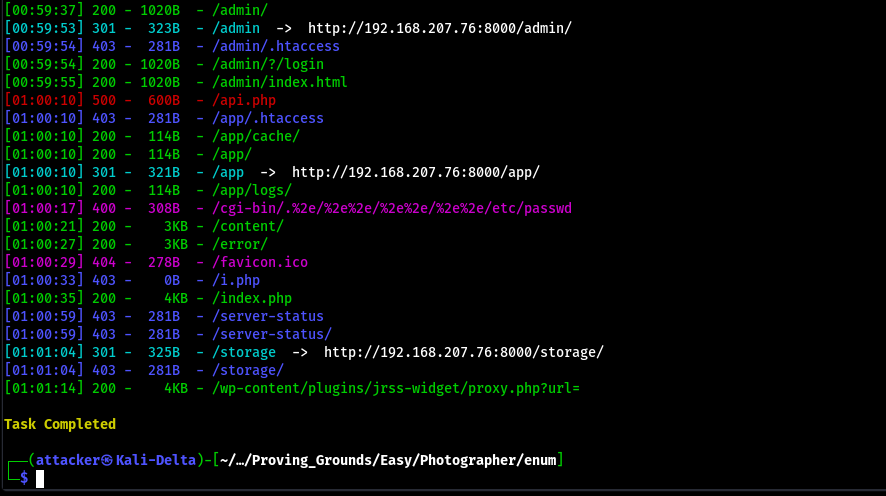

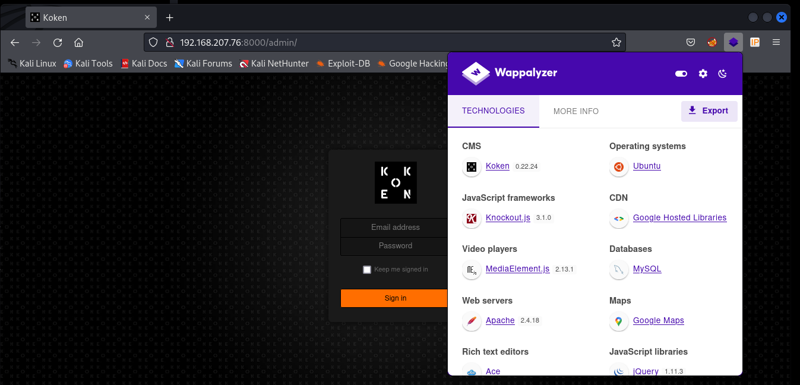

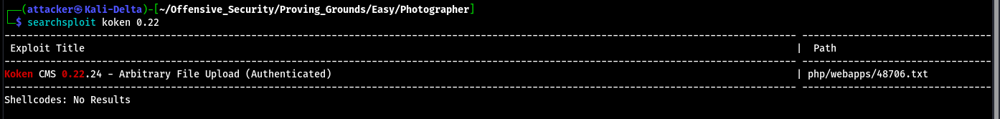

到這邊就完全卡住了 雖然知道email那邊應該是需要填剛剛在mailsent.txt裡面的東西 但密碼完全沒有想法 最後查了Write up才發現原來是在最後一行 Don't forget your secret, my "babygirl" ;) 哭阿==
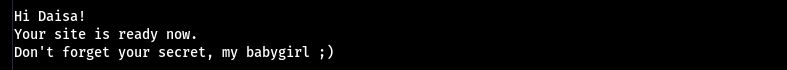

拿到憑證以後就能登入了`daisa@photographer.com:babygirl`
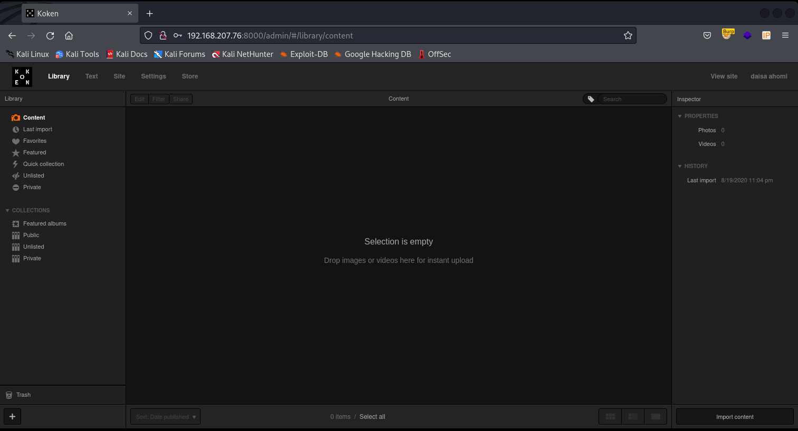

接下來照著exploit上面的做 點右下角的Import content 接著把剛做好的rev.pgp.jpg上傳並用Burp攔截下來 最後把.jpg刪掉再送出就成功Bypass限制了
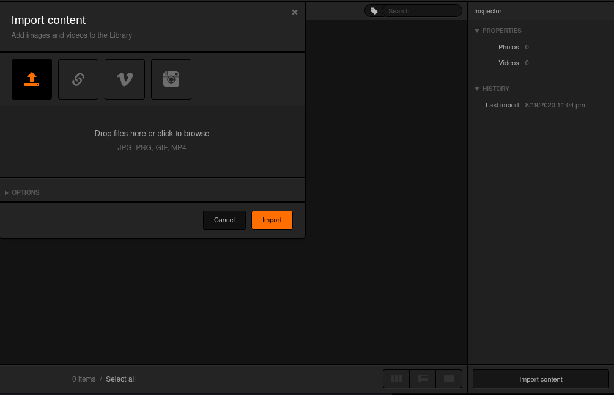

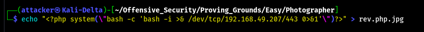

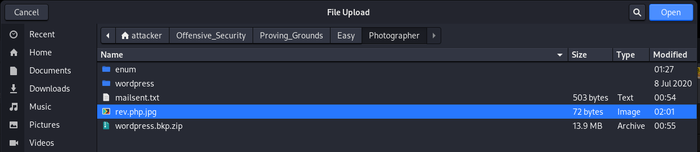

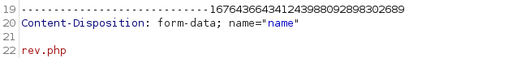

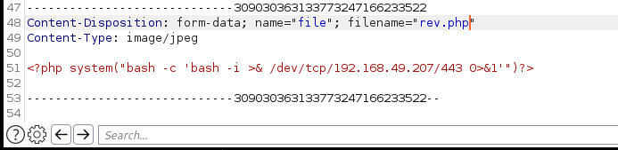

上傳以後在右邊的欄位往下拉可以看到一個連結 連上去以後就shell了
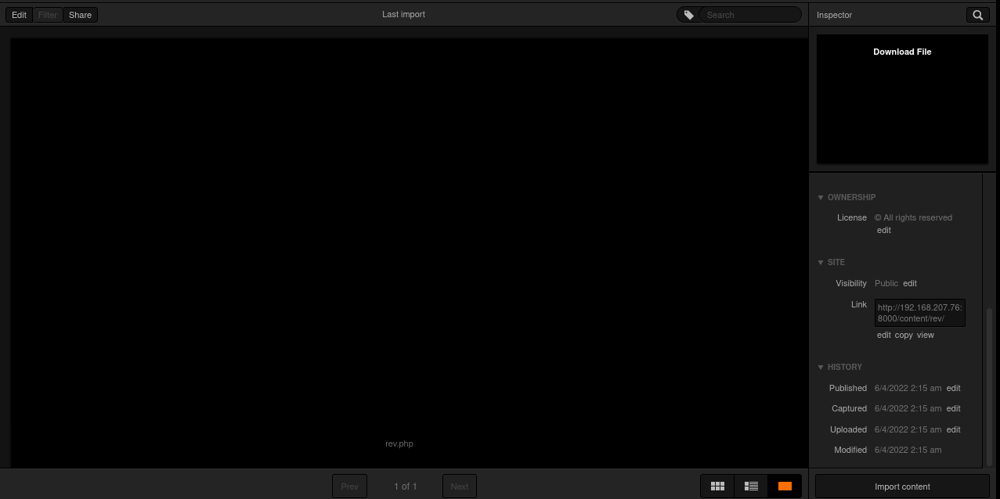

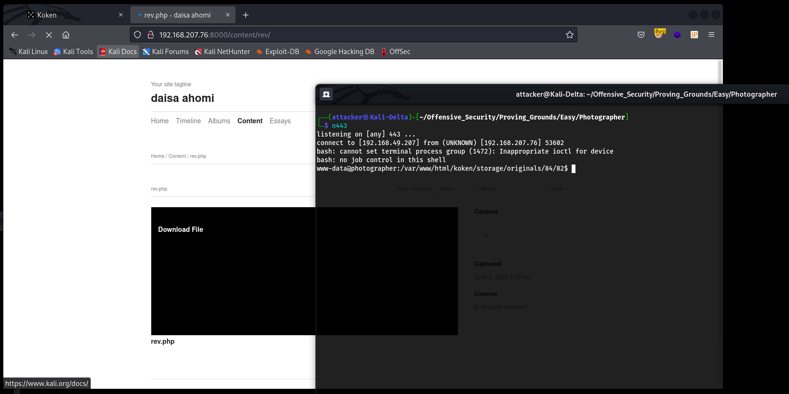

#### 垂直提權

跑linPEAS 發現有php 查了一下GTFOBins能找到一個SUID base的提權 打完就root了
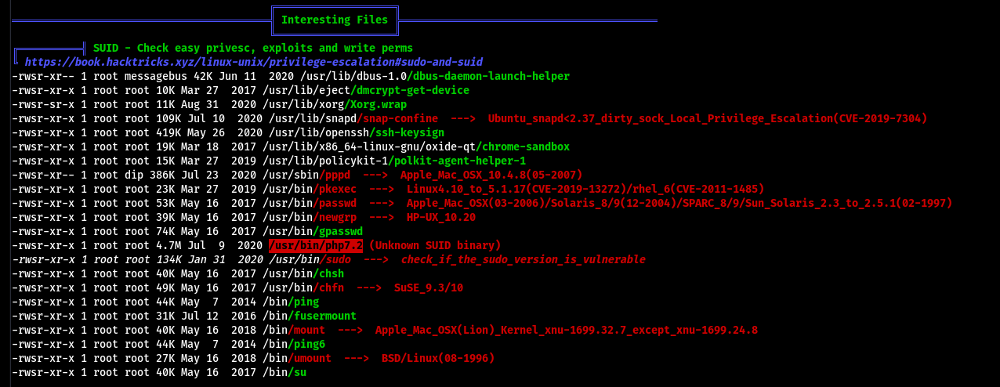

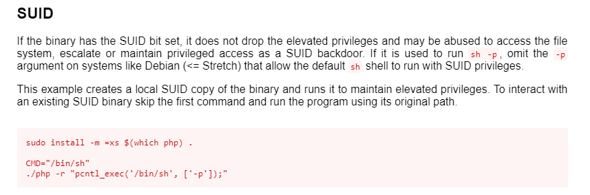

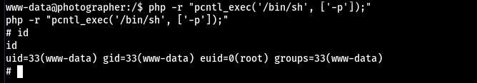

#### Proof

local.txt
`b5133a1a54c468f1436bd780bfdd15ab`
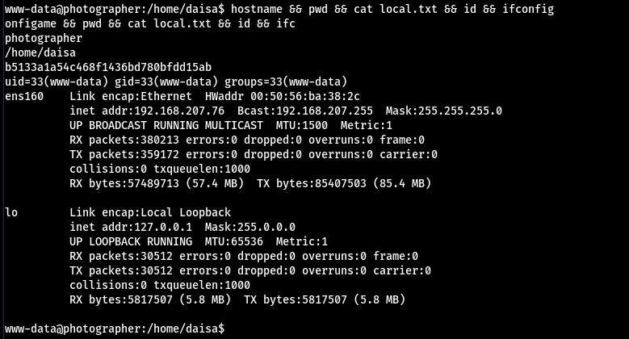

proof.txt
`47fee6bf7ecb4342919c3bc88f0c7f75`
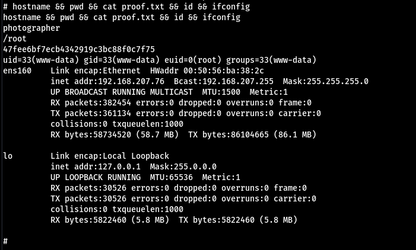