應該是打Web
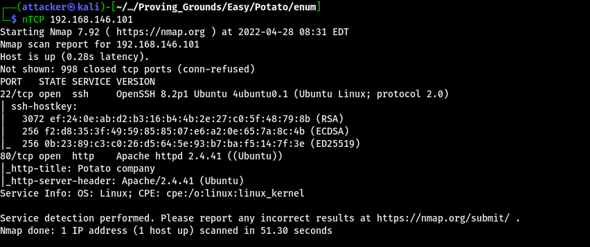

隨便掃一下路徑可以發現有奇怪的東西
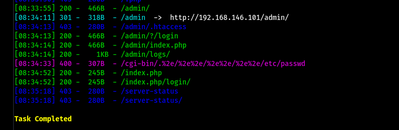

admin就單純的後台頁面 但弱憑證跟SQL Injection都不能用
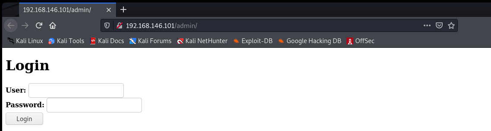

在logs裡面有一些log 但幾乎都是沒什麼用的資訊
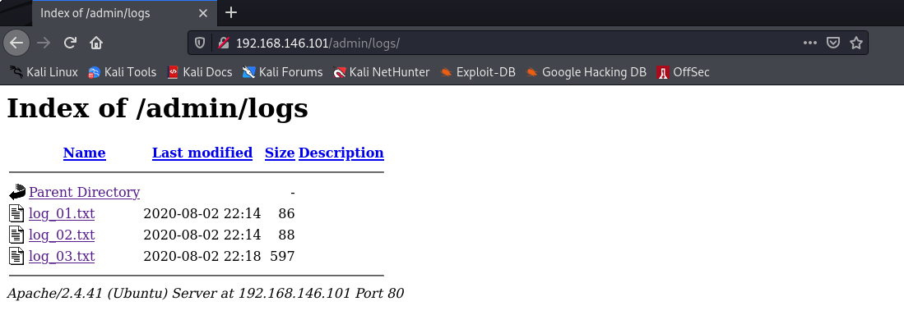

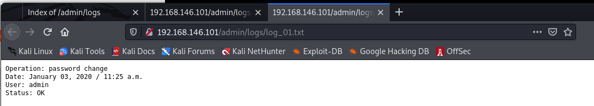

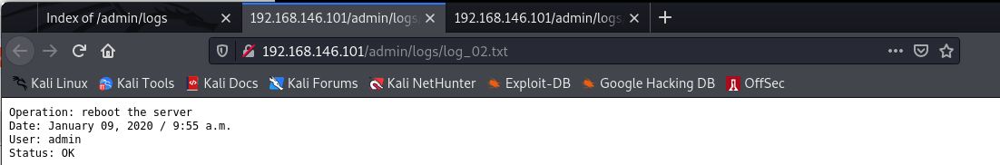

全Port的掃瞄結果出來了 可以看到有服務開在2112
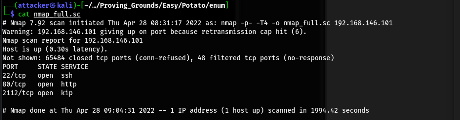

是ProFTPD 而且可以anonymous登入
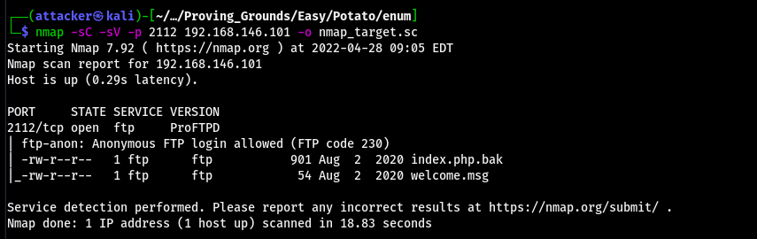

把index.php.bak載下來 貓他可以看到php的內容
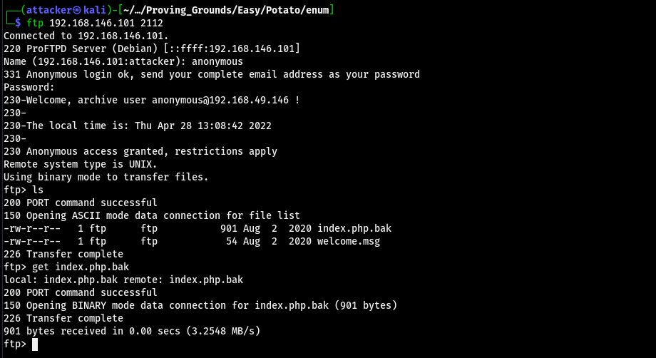

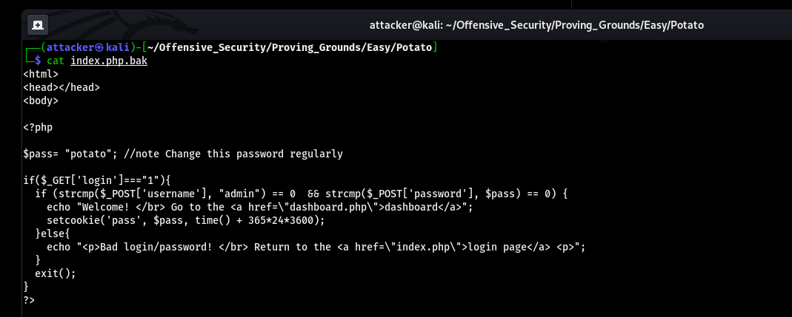

觀察一下 發現應該可以把password改成array來繞過登入
因為`strcmp(array(), "meow")`會等於NULL 所以這樣可以讓第二個判斷式=0

用Burp把封包攔下來 然後把password改成array 送出後就發現登入成功了
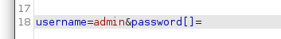

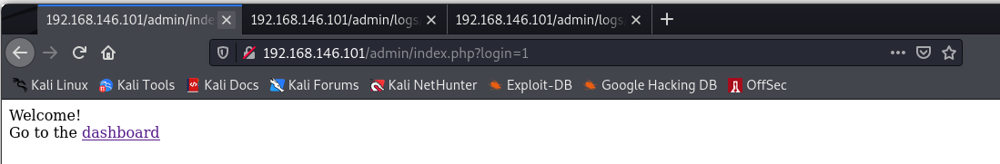

到管理介面裡面隨便逛了一下 發現Logs的頁面有LFI的漏洞 只要改一下送出封包的內容就能觸發

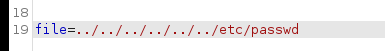

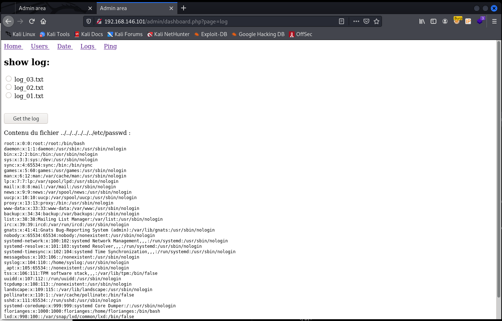

在passwd的最下面看到一個有hash的使用者 拖回來用john炸一下就拿到憑證了

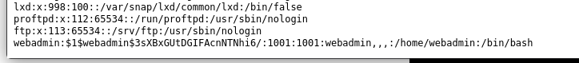

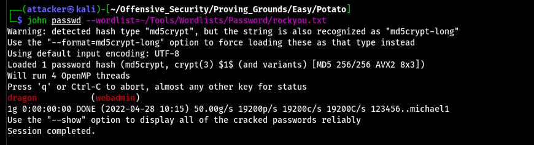

可以直接登入
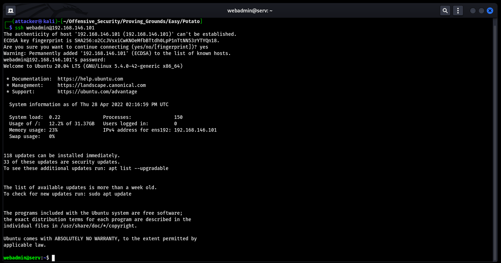

#### 提權

`sudo -l`可以看到一個奇怪的檔案 可以call到notes裡面的東西 看起來會直接執行對應的執行檔
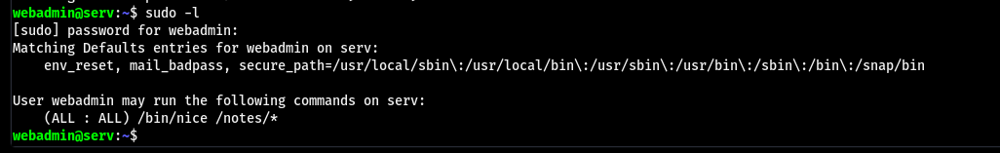

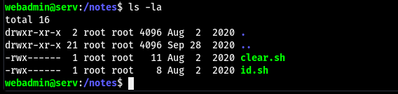

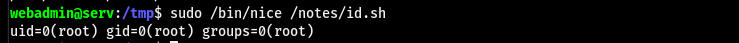

因為他後面是星號 所以可以隨便加東西進去 直接在/tmp下塞一個reverse shell讓他執行就好了
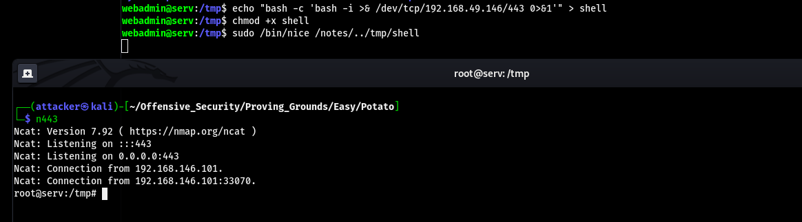

#### Proof

local.txt
`b57f9e8f2e09219fc0e9149439b0416f`
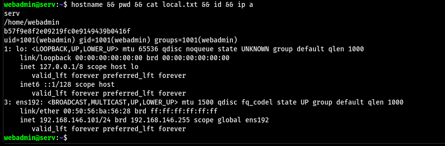

proof.txt
`85056f8e37b28a3bc37fe1542463e698`
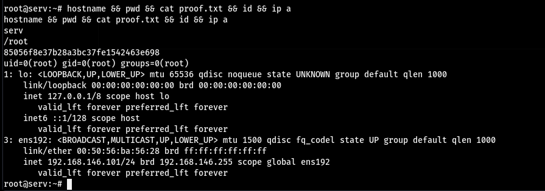