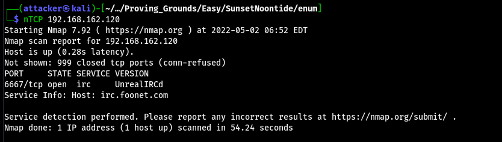
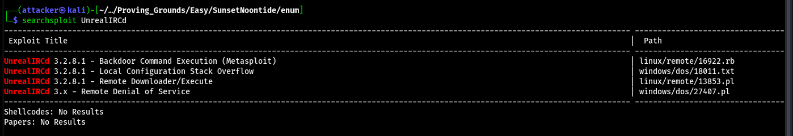
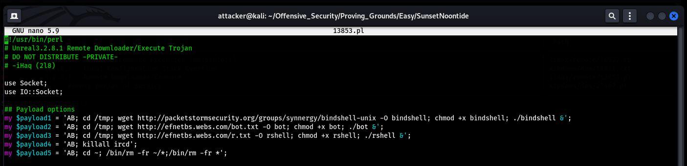
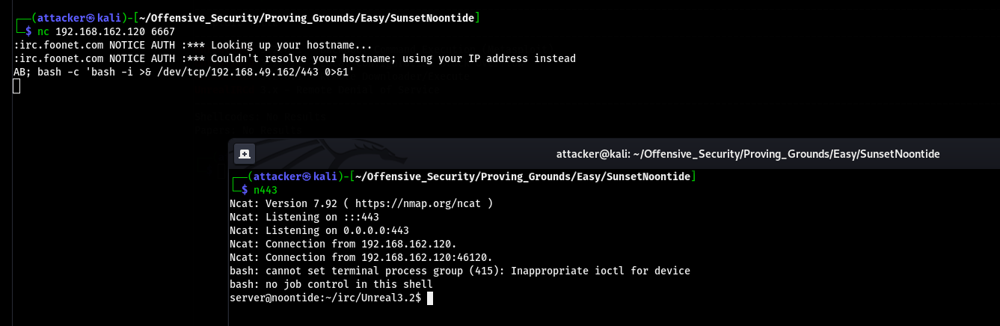
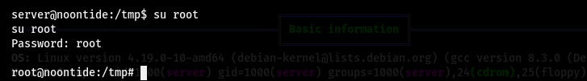
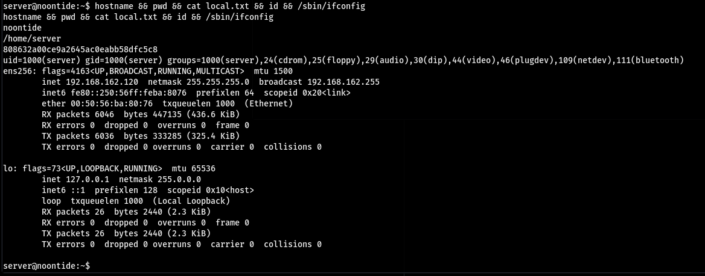
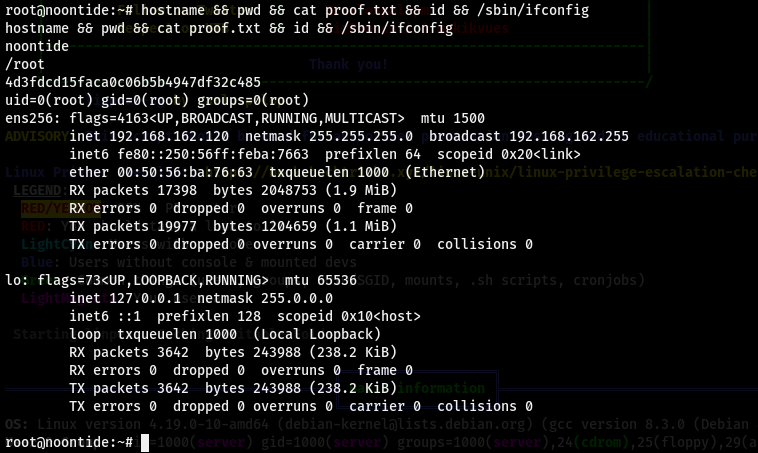

# SunsetNoontide

掃一下 只有IRC(?

好像有能用的exploit

把檔案拖過來看一下原始碼 發現payload看起來只是在做Command Injection(?

直接nc上去丟Payload就RCE了

## 提權

發現不管怎樣都提不了權 直到查了Write up發現是`root:root` 欸不是==

## Proof

local.txt
`808632a00ce9a2645ac0eabb58dfc5c8`

proof.txt
`4d3fdcd15faca0c06b5b4947df32c485`
