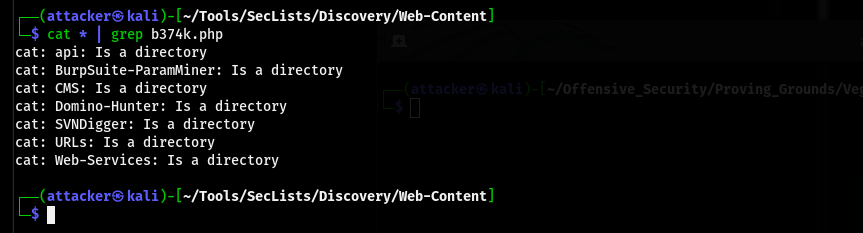

看起來80能進入

掃路徑 可以看到蠻多可疑的東西

進robots.txt可以看到/find_me

進去目錄能看到一個html

再點進去發現什麼都沒有 但看原始碼的最下面有奇怪的東西

拿去base64 decode 2次以後可以拿到一個QR Code 內容是`Password : topshellv`

但不知道為什麼我不管用什麼方式都枚舉不出下一步:( 所以只能去查Write up

????? 為什麼可以翻到b374k

翻了所有的字典檔都沒有 後來查到好像只能用作者自己在Github上的wordlist==

b374k沒東西 但看原始碼能看到一個路徑

連進去有一個hahahaha.wav

載下來聽 發現是摩斯密碼 丟到解密網站上可以拿到訊息
`USER : TRUNKS PASSWORD : US3R<KN>S IN DOLLARS SYMBOL)`

Username是trunks 密碼感覺很奇怪(? 還是他的意思是說只有前面 後面只是說S是美元符號

試`U$3R` 但沒有成功 換成`u$3r`就過了(?

#### 提權

發現`.bash_history`有點肥 cat出來看到一條奇怪的東西

但passwd沒有那東西QQ

NANI!! passwd居然可以寫

把預先做好的帳號丟進去後su就是root了

#### Proof

local.txt
`5379d252853d17ca5b8abbea630bf9ca`

proof.txt
`372a9044f016c804c0a5e0bfcf3d6265`
