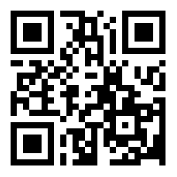

# Vegeta1 看起來80能進入   掃路徑 可以看到蠻多可疑的東西   進robots.txt可以看到/find_me   進去目錄能看到一個html   再點進去發現什麼都沒有 但看原始碼的最下面有奇怪的東西    拿去base64 decode 2次以後可以拿到一個QR Code 內容是`Password : topshellv`   但不知道為什麼我不管用什麼方式都枚舉不出下一步:( 所以只能去查Write up  ????? 為什麼可以翻到b374k   翻了所有的字典檔都沒有 後來查到好像只能用作者自己在Github上的wordlist==   b374k沒東西 但看原始碼能看到一個路徑     連進去有一個hahahaha.wav   載下來聽 發現是摩斯密碼 丟到解密網站上可以拿到訊息 `USER : TRUNKS PASSWORD : US3R<KN>S IN DOLLARS SYMBOL)`   Username是trunks 密碼感覺很奇怪(? 還是他的意思是說只有前面 後面只是說S是美元符號  試`U$3R` 但沒有成功 換成`u$3r`就過了(?   ## 提權  發現`.bash_history`有點肥 cat出來看到一條奇怪的東西   但passwd沒有那東西QQ   NANI!! passwd居然可以寫   把預先做好的帳號丟進去後su就是root了   ## Proof  local.txt `5379d252853d17ca5b8abbea630bf9ca`   proof.txt `372a9044f016c804c0a5e0bfcf3d6265` 